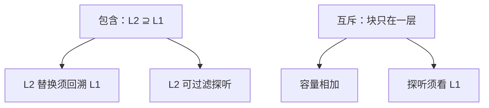

# 包含与互斥层次

L2 可以规定必须拥有 L1 的每一行，也可以规定与 L1 不重叠；作废与容量在两种约定下走相反的路。

<footer>—— 据 Hennessy and Patterson, Computer Architecture: A Quantitative Approach 整理</footer>

[上一课](/cs/cache-prefetch)允许把块提前填进某一层。多层 cache 至此仍像独立的 SRAM。[写回与写分配](/cs/write-back-allocate)只处理相邻两层的脏。本课不重讲预取步长。缺口是层次之间的包含关系：包含（inclusive）让下层成为上层的超集，便于探听过滤；互斥（exclusive）让块只在一层，容量相加。本课只钉这两种约定，不引入目录。

## 问题

私有 L1 加共享 L2 时，探听「某核有没有这行」若必须问遍所有 L1，延迟大。若 L2 包含所有 L1 行，L2 缺失即可断言 L1 也无，探听可以先看 L2。代价：L1 的行占 L2 容量，有效缓存变小；L2 替换一行必须把 L1 里的副本也作废。

互斥：L1 命中的行从 L2 拿掉，总容量接近相加。探听不能只看 L2。缺口不是新的相联度，而是**替换与作废时要不要维持「在上则必在下」**。

Intel 许多客户端 LLC 偏包含，便于探听；部分 AMD L2/L3 偏互斥，把容量加满。教学只取这两种理想端点。

## 方法

包含：填 L1 时也保证 L2 有该块（或稍后写回保持）。L2 驱逐 → 向 L1 发回溯作废/写回。预取填 L3 时，包含层次可能要求中间层也知道。

互斥：L1 缺失从 L2 取走该行（swap 或使 L2 无效）。L1 驱逐再放回 L2。两层不要长期存同一副本。

非包含（non-inclusive）介于中间：不保证超集，也不主动互斥。本课点名存在，不展开状态机。

## 机制

包含把一致性的「有没有副本」下推到更大的那一层，和后课窥探/目录衔接。互斥与预取：预取进 L2 不会自动出现在 L1，L1 冷缺失仍在；包含则可能让预取同时占两层容量。

[缺失分类](/cs/cache-miss-types)在多层要按层说：L1 冲突、L2 容量。包含使 L2 的有效 $C$ 小于标称容量。这是阿姆达尔项里「加大 L2」收益变小的原因之一。

## 边界

本课不引入 MESI，不处理多核。虚拟内存下一课改的是地址空间，不是这套包含约定；页表走访会经过这些 cache，包含关系照旧。也不把指令/数据 L1 的互斥当成第三种主策略。

后课默认：谈到多层，先问包含还是互斥。程序员仍看见虚拟地址；翻译是分页课。

## 小结

- 包含：下层超集，替换须回溯，探听可过滤。
- 互斥：块只在一层，容量相加，探听更贵。
- 虚拟页与页表是下一课；本课只收 cache 层次约定。
- 出处：Hennessy and Patterson, *CA:AQA* 多层 cache 包含性。
