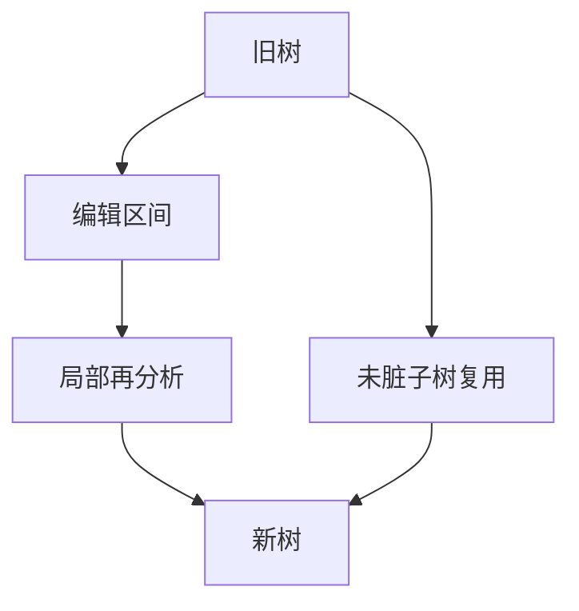

# 增量解析 tree-sitter

源文本改了一处，分析树只重算受影响的区间；编辑器要的是毫秒级更新，不是整文件再跑一遍 yyparse。

<footer>—— 据 Wagner and Graham, Incremental Analysis of Real Programming Languages, 1998；tree-sitter 设计文档整理</footer>

上一课[错误恢复](/cs/parse-error-recovery)让整文件分析可以带着诊断走完。编辑会话里每次击键都全量 LALR 太贵。缺口是**增量**：把旧树与编辑区间对齐，复用未改子树。tree-sitter 用 GLR 方言与显式树，是这一课的工程锚点，不是唯一理论。本课不重写 GLR 分叉。

## 问题

全量分析 $O(n)$ 对百万行尚可，对每次击键的交互不行。增量：保留具体语法树（带源区间），编辑映射到插入/删除区间，从该区间的祖先重新分析，其它子树当记号或子语言复用。缺口是**复用条件**，不是再定义 CFG。

错误节点：tree-sitter 在失败处插 `ERROR`，以便高亮与缩进仍工作。这与编译器的 `error` 产生式同类，目标是编辑器而非代码生成。

### 复用不是「字节没改就语义没改」

宏、C 预处理器、依赖头文件会使「没改的区间」语义变。tree-sitter 默认按文件、按语言文法，不跑 cpp。真正编译器的增量要另做依赖图——本课只钉语法树增量。

Wagner–Graham 1998（PLDI）讨论真实语言的增量分析。tree-sitter 公开设计：GLR、显式冲突、增量。本课不把 Language Server 协议当文法理论。

## 方法

保存旧树与旧文本。应用编辑，得新文本与脏区间。从脏区间对应的旧节点向上找到可再分析的边界（如函数、块）。在该子语言上跑分析器，把新子树接回。token 复用：词法也可增量，改空白尽量不动后继树。

与 Pratt/手写下降：增量更难，因为下降的调用栈没有显式区间树。这是「生成树、带位移」的动机。

## 机制

最坏仍可能接近全量（在文件头改一个括号）。摊还在局部编辑上接近脏区大小。多语言嵌入（Markdown 里的代码块）靠外部扫描器切片段，各片段独立文法——点名，不写完。

编译器中端（SSA、数据流）增量是另一问题：语法树没变的函数仍可能因内联热度重优化。本课停在前端树。

## 边界

本课不实现 tree-sitter 的 C 运行时，不讲查询语言。后课默认：编辑器增量 ≠ 编译器全量语义。下一课从树到属性：属性文法，给节点挂值而不必立刻手写访问者。

不要把增量解析当成类型检查的增量；名字解析跨文件时脏区会跳。

## 小结

- 增量：脏区间再分析，未改子树复用。
- tree-sitter：GLR 树 + 错误节点，服务编辑器。
- 预处理器与跨文件语义不在复用假设里。
- 出处：Wagner and Graham, 1998；tree-sitter 文档；对照 Tomita GLR。
