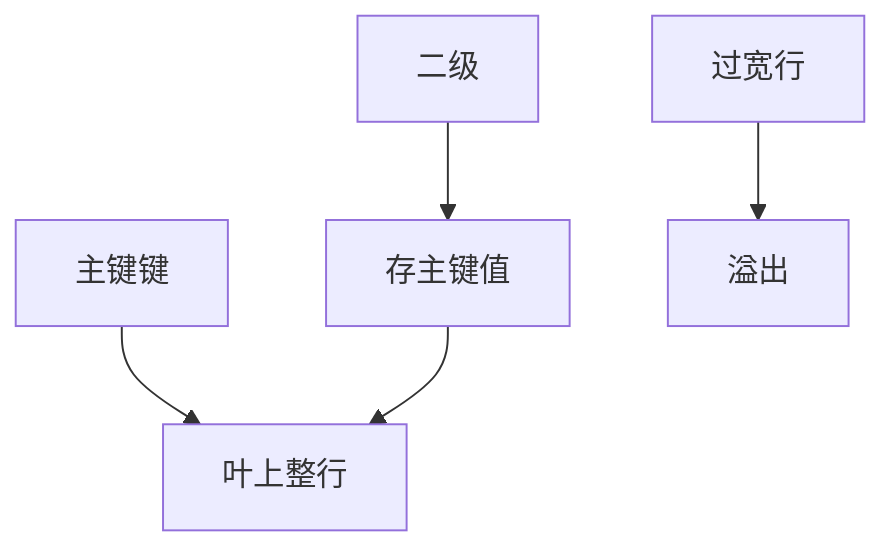

# 索引组织表

没有独立堆：主键 B+ 的叶就是行。二级索引必须带回主键，范围主键是第一公民，随机主键是页分裂税。

<footer>—— 据 Ramakrishnan and Gehrke index-organized；Oracle IOT；InnoDB 聚簇抽象</footer>

[上一课](/cs/clustered-secondary-lookup)把回表说清。本课把聚簇一侧说绝：索引组织表（IOT）= 主键索引即表。引擎对照序列封口；事务进阶从时间戳排序再开。缺口是抽象合同，不只 InnoDB 商标。

## 问题

堆表：插入有堆页选择（追加、FSM）。IOT：插入位置由主键唯一决定，叶满则分裂，与 B+ 分裂课同一算法，只是载荷是整行。溢出：行太大则叶存关键列+溢出指针，上一课变长仍适用。缺口是**何时选 IOT**：主键范围、点查 pk 为主、表不太宽；否则叶扇出差、二级回表键很长。

无主键：InnoDB 仍隐式聚簇行号；那是实现补丁，设计上应显式主键。Postgres 无 IOT 作为默认，堆是第一公民。

Oracle Index-Organized Tables 是教科书名字。二级索引存主键值，主键长则二级肥——复合主键要短。本课不推销某厂。

## 方法

设计：短、稳定、与范围查询对齐的主键。二级：覆盖常用投影，减少回主键。分区可叠在 IOT 上（按主键前缀）。迁移堆→IOT 是整表重写。

并发：叶热点（单调主键插入）把 latch crabbing 打在同一右热叶上——可改哈希主键或打散，与 UUID 课的缓冲污染同一权衡。

## 机制

扫描：主键序扫描即表扫描，zone map/BRIN 类结构在 IOT 上变成沿叶的区统计。vacuum：InnoDB purge undo；不是堆 vacuum，但叶页仍要合并。TDE 盖叶页与溢出页。

优化器：表扫描代价按叶链页数，不是堆占用（含空洞）的同一公式——膨胀定义不同。

## 边界

本课不讲时间戳排序并发。也不把 IOT 当列存。存储进阶结束：从缓冲策略、索引族、列格式到两家行引擎。

后课默认：IOT 让 pk 范围顺序化，二级回主键。时间戳排序：不用 2PL，按时间戳接受或拒绝读写。

主键即布局。选错主键就是选错物理序。

## 小结

- IOT 叶内存行；二级回主键；主键应短而稳定。
- 单调插入热叶是并发与缓冲问题。
- 下一单元时间戳排序：并发控制续的第一课。
- 出处：Ramakrishnan and Gehrke；Oracle IOT；InnoDB 聚簇。
