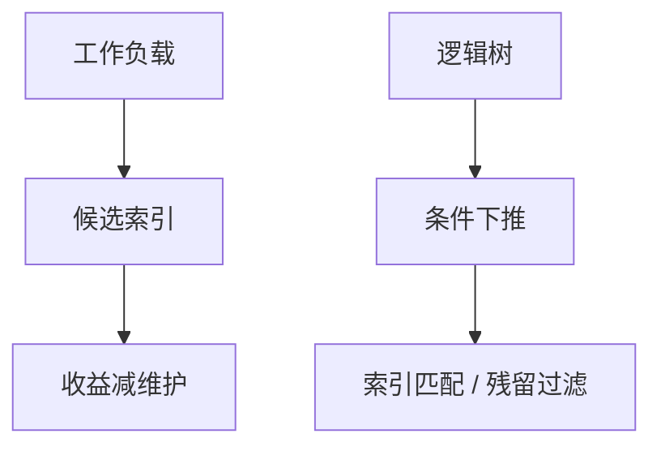

# 索引选择与条件下推

索引是物理设计的赌注：哪些谓词值得变成有序或哈希访问。条件下推把谓词贴到扫描上，否则索引建了也用不上。

<footer>—— 据 Chaudhuri and Narasayya 自动索引选择；Selinger 访问路径；谓词下推主干课的物理侧</footer>

[上一课](/cs/learned-optimizer)把反馈收成估计插件。本课不训练模型。缺口是物理设计与改写的交界：主干 [覆盖索引](/cs/covering-index)、[谓词下推](/cs/predicate-pushdown) 已有概念；进阶要把**选哪些索引**与**谓词能否贴到索引扫描**一次讲清，否则优化器单元只在既定索引上搜。

## 问题

索引太多：更新、空间、优化时间（每个索引都是访问路径候选）。太少：全表扫描。自动选择把工作负载当输入，在候选索引集上搜索收益（估计代价下降）减维护成本。缺口还包括下推：`WHERE` 里的函数包住列（`f(col)=1`）会挡住索引匹配；外连接、窗口、分组是防火墙，谓词不能穿越。

下推是逻辑改写；索引匹配是物理。两者失败症状都是「扫太多行」，诊断要分开。

Chaudhuri and Narasayya 的 AutoAdmin 索引选择。下推合法性仍由代数与 NULL 决定，本课不重推三值。INCLUDE 列服务覆盖，属于设计空间。

## 方法

候选：查询里等值、范围、连接键、`ORDER BY`/`GROUP BY` 前缀。搜索：贪心加索引、或整数规划近似。约束：每表索引个数、写放大预算。条件下推：把选择算子推到扫描与连接之下，直到防火墙；再看残留谓词能否当索引条件（sargable）。

部分索引、表达式索引：把不可 sargable 的计算预物化进索引键。这是设计，不是运行时下推。

## 机制

优化器在 DP 单表步枚举：堆扫、各匹配索引、位图交（后课位图索引）。选择结果依赖统计。错误下推改变指称，比选错索引更严重——先合法后代价。

物化视图是「预计算查询」的索引亲戚；刷新下一课。本课索引是访问路径，不是另一张用户表。

## 边界

本课不讲物化视图增量维护代数。也不把 DBA 提示当选择算法。计划提示下一课之后。分区裁剪是表分区课的下推亲戚，存储进阶再写。

后课默认：先让谓词 sargable 并下推，再谈加索引；自动选择有写放大预算。物化视图刷新是另一份维护合同。

没有下推，最宽的覆盖索引也只是又一次全扫叶子。

## 小结

- 索引选择用工作负载权衡读收益与写成本。
- 条件下推与 sargable 决定索引能否被匹配。
- 物化视图刷新下一课：预计算查询的维护。
- 出处：Chaudhuri and Narasayya；Selinger；Ramakrishnan and Gehrke。
