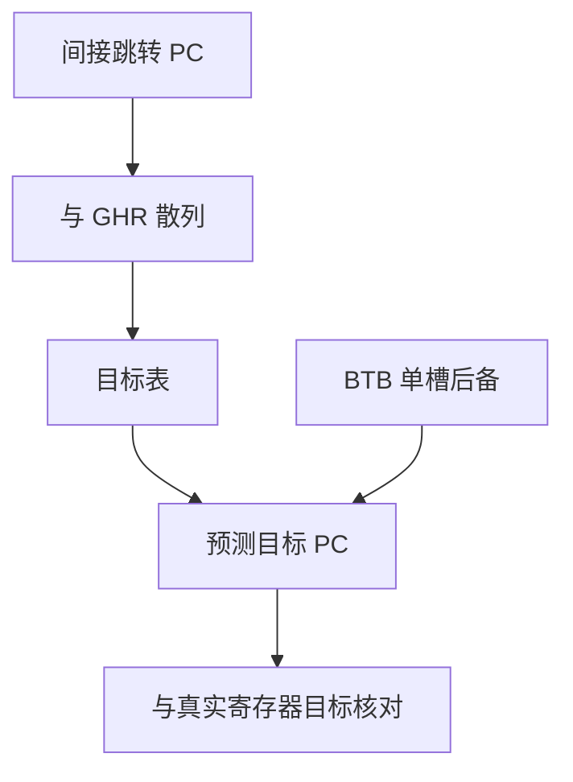

# 间接分支预测

虚调用和跳表的下一 PC 来自寄存器，不是立即数；目标缓冲按地址缓存上一次，相关间接则还要历史选出「哪一个目标」。

<footer>—— 据 Chang, Hao, and Patt, Target Prediction for Indirect Jumps, ISCA 1997；Hennessy and Patterson, CA:AQA 整理</footer>

[上一课](/cs/perceptron-predictor)把条件方向做成特征点积，输出仍是跳或不跳。[BTB](/cs/btb-ras) 对间接跳转只存一个目标：同一个 `jalr` 若在两次调用里走向两个虚函数，BTB 会来回颠簸。本课不重训感知器。缺口是：**一个 PC 对应多个合法目标时，如何用历史选出下一个地址。**

## 问题

面向对象的虚调用、解释器 `switch`、语言运行时的间接跳转：目标来自寄存器或内存，ISA 在译码前不知道。BTB 命中给的是「上次」，对双态目标大约 50%。返回已有 [RAS](/cs/btb-ras)，不要把 `ret` 再塞进本课的表。缺口不是更准的条件 gshare，而是**按（PC，历史）缓存目标 PC**。

Chang–Hao–Patt 把目标预测做成带历史的表，而不是只靠 BTB 的单槽。ITTAGE 把 TAGE 的标签几何搬到目标上，是后日工程化，本课先钉「历史选目标」。

## 方法

间接目标表（ITT）：索引 `hash(PC, GHR)` 或 `hash(PC, 局部历史)`，条目存完整目标 PC 与可选标签。命中则 IF 用该目标；核对寄存器算出的地址，错则更新该槽（或分配新槽）。可与 BTB 并行：ITT 未命中则退回 BTB 的「上次」。

RAS 优先于 ITT：调用/返回配对不是「多目标相关」，是栈。

## 机制

条件预测错只冲刷方向；间接错则连取指流都走错页，损失拍数通常更大。面向对象程序的 CPI 往往被这里钉住，而不是被 `beq`。表项要存完整地址（或至少虚页内偏移 + 标签），比两位计数器贵。别名会把 A 的目标填进 B 的槽，表现为「跳进错误函数」——架构上仍会核对并冲刷，只是浪费窗口。

推测：ITT 的更新与 GHR 一样，误预测路径上的间接会污染；检查点或在提交时才写表。

## 边界

本课不把 CFI / 间接跳转检查当预测器：那是安全课的落点，预测错了会冲刷，恶意目标是另一威胁模型。也不展开 ITTAGE 的每一张几何表。循环里「迭代 $N$ 次后改变方向」是下一课循环预测器，与间接表正交。

后课默认：间接目标用历史选槽；返回用 RAS。方向与目标是两套结构。

## 小结

- 多目标间接不能只靠 BTB 单槽；用（PC，历史）缓存目标。
- 返回继续走 RAS，不要与虚调用混表。
- 固定迭代次数的条件分支是下一课循环预测。
- 出处：Chang, Hao, and Patt, *ISCA*, 1997；Hennessy and Patterson, *CA:AQA*。
