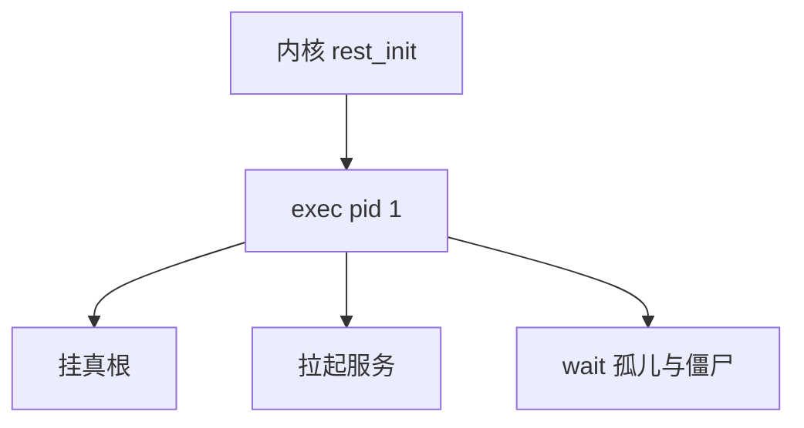

# init 与用户空间

内核创建的第一个用户进程是 pid 1：它不得退出；负责挂载真根、拉起服务，并收养孤儿。

<footer>—— 据 Unix 传统 init；Stevens；systemd 作为当代实现的对照整理</footer>

[上一课](/cs/early-boot)把 CPU 交到能 `exec` 用户程序的点。[进程映像](/cs/process-image) 的孤儿由 init 收养，当时是前瞻。缺口是 **pid 1 的义务**：不是某个发行版的单元文件百科，而是内核与用户空间的契约——退出则 panic、等待僵尸、按策略启动其余作业。

## 问题

内核不应内置「如何启动图形界面」。它 `exec` 配置指定的 init（或 `/sbin/init`）。init 切换根、按依赖启动 getty、网络、sshd。子进程退出必须 `wait`，否则僵尸堆积。缺口：这是用户态策略，内核只保证 pid 1 特殊（不可杀于普通 OOM 策略之外、信号受限）。systemd、SysV init、busybox 都是这一角色的实现。

双用户空间（如恢复壳）仍是某个 pid 1。容器里的「init」可以是该 pid 命名空间的 1 号，内核课下一课 namespaces 才切。

## 方法

`kernel_init` 路径 exec 用户程序。该程序：`mount` 真根、`chroot`/`pivot_root`、打开 tty、fork 服务。关机：init 收服务、同步磁盘、通知内核 reboot。与 [fsync](/cs/fsync)/writeback 的接头：关机必须刷脏页。不要把桌面会话管理写进内核义务。

## 机制

init 把「机器可用」从内核对象变成用户策略：同一内核可变成服务器或嵌入式器具。OOM 杀 pid 1 会导致内核认为用户空间已死。tty 的 getty 由 init 拉起，登录后 shell 的控制终端上一课已讲。本课不比较发行版谁更正确。

## 边界

本课不引入 cgroup 的委托全文（下一课）。不把云-init 当内核接口。下一课：同一内核上切出多套「看起来像独立机器」的名字——pid、挂载、网络等命名空间。

后课默认：一台机器有一个全局 pid 1。把 pid/mnt/net 等名字隔离，下一课 namespaces。

## 小结

- pid 1 是用户空间根：挂根、启服务、收养孤儿。
- 内核几乎不内置服务策略。
- 名字隔离是 namespaces 的缺口。
- 出处：Unix init 传统；Stevens；Tanenbaum *MOS*。
