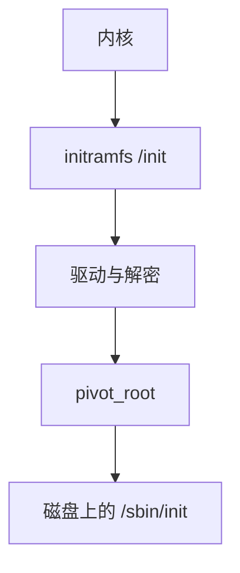

# initramfs 与 pivot_root

initramfs 是内核解开的内存根：里面的脚本开 [dm-crypt](/cs/dm-crypt)、组 [RAID](/cs/md-raid)、加载驱动，再 pivot_root 到真正的磁盘根。

<footer>—— 据 Linux initrd/initramfs 文档；pivot_root(2)；[tmpfs](/cs/tmpfs) 为内存树先修</footer>

[TPM](/cs/tpm-measured-boot) 可能在这一阶段解封。[设备节点](/cs/device-nodes) 需要驱动。缺口是 **早期用户空间** 与切换根，不是 systemd 全部。

## 问题

内核不能把所有磁盘/LVM/网络模块编进镜像。initramfs：cpio 进 RAM，`/init` 跑。缺口：`switch_root`/`pivot_root` 把旧根丢掉或移走，避免占用；与 [overlay](/cs/overlayfs) 做运行时根。本课不把 dracut 模块列表抄完。

initrd 是旧块设备形式。今日多为 initramfs。紧急壳在此阶段常见。

## 方法

内核挂载 ramfs → exec `/init` → 组装 `/dev`、解密、fsck → pivot 到 `/newroot`。对照 [FUSE](/cs/fuse)：此时通常还没有。对照 [NFS](/cs/nfs-semantics) 根：init 要先有网卡。对照 kexec：另一条启动，不在本课。

## 机制

initramfs 把「内核太早、根还不可用」收成用户态程序，使复杂存储栈可启动。它是信任链的一环：未签名的 initramfs 可偷密钥。不要写成发行版安装器。与 [memcg](/cs/memcg)：此阶段通常无 cgroup 限制。

失败：掉进 emergency shell，对象仍是这棵内存树。

实现上：initramfs 里的密钥提示是攻击面，TPM 解封应在此阶段。pivot 后要 umount 旧根，否则 ramfs 占着内存。emergency shell 仍是这棵树，网络可能还没有。 读法上只引用[上一课](/cs/tpm-measured-boot)的结论，不把对象换成训练推理或限价簿。

本课在操作系统进阶的「安全、启动与调试 / 内核安全与启动」课序里，对象是 **initramfs 与 pivot_root**。

- 先修只引用，不重导：上一课的结论当公理，本课只补差。
- 五栏不吞并：不把本课写成大模型训练/推理，也不写成限价簿或权重量化。
- 文献用 OSTEP、McKusick、内核文档与具名会议论文；不发明 arXiv 编号。

## 边界

本课不引入所有 resume from hibernate 细节——挂起后课。不保证嵌入式无 initramfs。下一课真正的 PID 1：systemd 单元。

版本字段会变，课序钉的是机制对象「initramfs 与 pivot_root」，不是某一主线内核的结构体名。
后课默认：磁盘根经 pivot 接上。systemd 单元与依赖，下一课。

## 小结

- initramfs 在内存里准备真根。
- pivot_root 切换，旧 ram 根释放。
- systemd 单元是下一课。
- 出处：Linux initramfs；`pivot_root(2)`；dracut。
