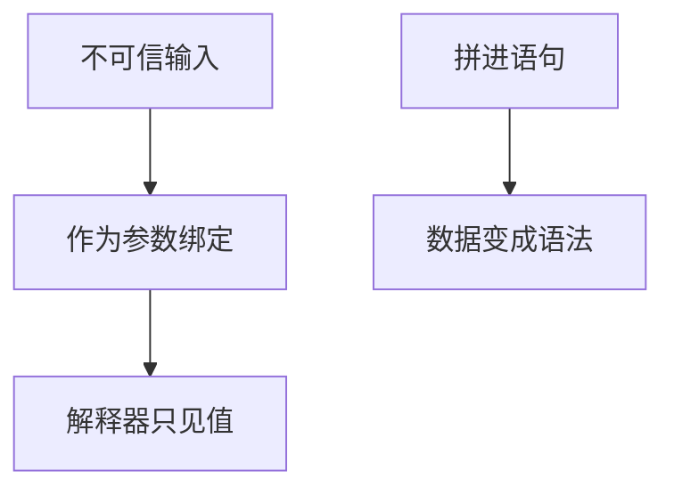

# 注入作为输入边界

不可信字节一旦被当成另一语言的语法来解释，完整性与授权就落在解释器里而不是落在你的程序里。

<footer>—— 据 Saltzer 完整中介；Anderson 对注入类失败；对照参数化查询与类型化 API</footer>

[上一课](/cs/same-origin-csrf)把浏览器代理人与意图分开。本课不重做 Cookie。缺口是更一般的边界：SQL、壳、HTML、模板都是解释器。把用户字符串拼进语句，等于让外人写程序。防御是参数与上下文编码，而不是「过滤几个字符」。本课是安全主干最后一课；下一课封口整个计算栈。

## 问题

CSRF 是混淆代理人。注入是混淆语言：数据通道与控制通道合一。数据库课的 [SQL](/cs/sql-declarative) 是语言；若查询字符串由拼接生成，完整性（谁被更新）与授权（哪一行）不再由参数决定。缺口是**输入必须停在数据槽里**。本课不提供任何可执行的注入语句或绕过清单。

参数化查询、ORM 的绑定、避免壳、模板自动转义，都是同一句话：先选解释器，再只传值。WAF 是补偿控制，不是规格。

## 方法

接口：占位符 + 绑定值；API 不暴露「拼完再 exec」。HTML：按上下文编码（元素 vs 属性），而不是同一套替换。最小特权：解释器用的账号不能是管理员。完整中介：每一次解释都经过绑定层。与 [TOCTOU](/cs/toctou) 对照：都是判决没落在真正被解释的那份对象上。

## 机制

绑定把 DY 敌手能注入的「项」限制在值域，语句树由应用固定。这服务 CIA 的 I 与授权（E）。TLS 与同源不替代本课：信道可以很干净，拼出来的语句仍然是外人的程序。后课[计算栈到此为止](/cs/to-systems-boundary) 不再补一种解释器。

## 边界

本课不把注入细类写成考试名单，不讨论绕过过滤器的技巧。计算机栏主干在下一课封口，不进入大模型或限价簿。

后课默认：不可信输入不得成为宿主语言。系统栈课程结束，附录只对照文献。

## 小结

- 注入是数据被当成语法；防御是绑定与分上下文编码。
- 与 CSRF 不同：这里是解释器边界，不是 Cookie 意图。
- 下一课封口本栏主干。
- 出处：Saltzer and Schroeder；Anderson；对照 Date/SQL 绑定实践。
