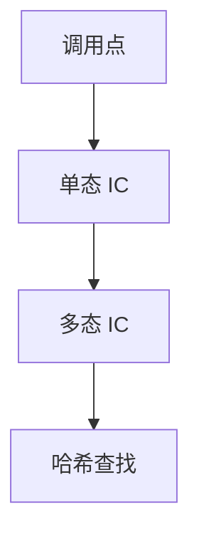

# 内联缓存

调用点记住上次接收者的类与方法地址：同类则直跳，不同类则回慢速查找。单态缓存命中时，动态分派接近静态调用。

<footer>—— 据 Deutsch and Schiffman；Hölzle, Chambers and Ungar, Optimizing Dynamically-Typed Object-Oriented Languages with PICs 整理</footer>

上一课[追踪 JIT](/cs/tracing-jit) 沿路径投机类型。缺口是**调用点投机**：内联缓存（IC）。Smalltalk/Self/JS：方法查找贵。单态 IC：一个类；PIC：几个类的跳表。本课钉 IC，去优化下一课收失败。

## 问题

vtable 对静态类层次快；动态语言形状（hidden class）运行时变。IC：调用点状态机。缺口是**把查找结果焊在调用点**，不是整段 trace。

与[类型类字典](/cs/typeclass-dictionary)：都是间接调用，IC 可改成直跳并内联。

### IC 不是 CPU 的 I-cache

Inline cache 是语言实现；instruction cache 是硬件。不要混名。

Deutsch–Schiffman。Hölzle–Chambers–Ungar PIC（OOPSLA）。V8/IC 状态机是工程后裔。

## 方法

未初始化：查表，填缓存。单态：比较类字，命中则调用缓存地址。失配：变多态或 MEGAMORPHIC（回哈希）。JIT 可对单态直接内联，失配去优化。

与逃逸/形状：对象布局稳定 IC 才稳。隐藏类转移会刷缓存。

## 机制

线程：IC 更新要原子或每线程。不要无限 PIC 变大。统计：调用点的多态度决定是否内联。

与方法 JIT：编译时把 IC 变成 cmp+je 序列。

## 边界

本课不写去优化栈重写。后课默认：动态调用用 IC。下一课去优化：投机失败如何回解释器状态。

也不把 IC 当 HTTP 缓存。

## 小结

- IC：调用点缓存接收者类与目标。
- 单态可内联；超多态回慢路径。
- 与 vtable 静态分派 complementary。
- 出处：Deutsch and Schiffman；Hölzle, Chambers and Ungar。
