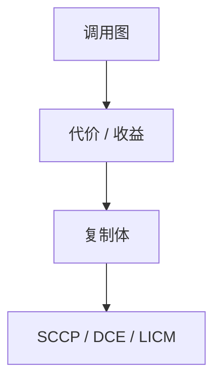

# 内联启发

内联用调用点的体替换 `call`，消除开销并暴露过程内优化。预算、热度与是否递归决定做不做，而不是「凡是能内联都做」。

<footer>—— 据 Davidson and Holler；Ayres 等内联研究；Appel；龙书过程间优化整理</footer>

上一课[调用图](/cs/interprocedural-callgraph)知道 callee。缺口是**复制体的决策**：小函数几乎总内联；大函数只在热路径；递归要阈值。本课钉启发与副作用（代码膨胀、编译时间），不写尾调用——下一课。

## 问题

每次调用有 ABI 开销与屏障（许多优化不跨 `call`）。内联后常量实参触发 SCCP，虚调用可能去虚。代价：I-cache、编译时间、调试。缺口是**成本模型**，不是 CG 构造。

始终内联：`always_inline`、模板单态化后的小函数。永不：函数指针外部、`noinline`、过大。

### 内联不是宏

宏是记号改写，无作用域；内联是 IR 级，遵守作用域与类型。C 的 `inline` 关键字还与链接（弱符号）纠缠，后课符号。

经典编译器内联启发式。LLVM InlineCost。PGO 后课提供热度。本课静态：体大小、调用深度、是否有 alloca。

## 方法

自底向上沿 CG（先叶）。对每个调用点打分：指令数、是否可常量传播、是否在循环。超过预算停。递归：允许浅层或只内联一次（peel）。

与单态化：特化后的体更小更值得内联。与栈：内联加深帧，除非再缩。

## 机制

间接调用：先去虚（唯一目标）再内联。失败则留 `call`。不要内联改变可观察异常表顺序的语言细节而不更新表。

链接期内联（LTO）看见其它 TU 的体——后课 LTO。

## 边界

本课不写完整 profile 计数。后课默认：内联由预算与热度约束。下一课尾调用：不内联也能把调用变成跳转。

也不把内联当混淆（故意复制）。

## 小结

- 内联消除调用并暴露优化；膨胀是代价。
- 启发：大小、热度、递归深度。
- 与摘要分析互补：不内联也能传 mod/ref。
- 出处：Davidson/Holler；Appel；龙书；对照 LLVM InlineCost。
