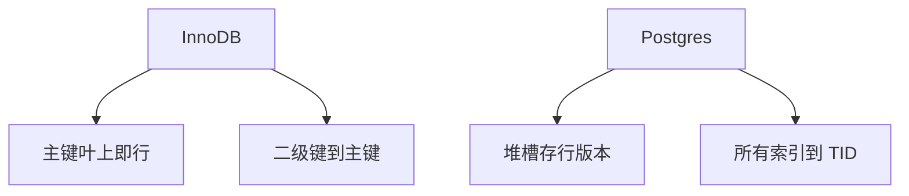

# InnoDB 对 Postgres 堆

InnoDB 主键即聚簇：行跟在主键叶上。Postgres 堆是无序页，索引一律二次查找。两种页合同决定回表、覆盖与 vacuum 的形状。

<footer>—— 据 Ramakrishnan and Gehrke 聚簇；InnoDB 与 PostgreSQL 存储文档；Gray</footer>

[上一课](/cs/tde-compression)把加密放在 I/O 路径。本课打开引擎对照：同样关系代数，行放哪。缺口不是再定义 B+，而是两条工业路径——聚簇索引表 vs 堆+二级索引——对覆盖、范围扫描、MVCC 版本落点的影响。细节 undo/redo、vacuum 后课补。

## 问题

聚簇（索引组织）：按主键序存整行，主键范围扫描是顺序 I/O，二级索引存主键（再回聚簇）或存 RID。堆：插入常追加，物理序与主键无关，主键也是二级结构，RID 指堆槽。缺口是**默认访问路径**：`WHERE pk BETWEEN` 在 InnoDB 走叶链；在 Postgres 走主键索引再随机堆，除非额外 `CLUSTER`（一次性，不维持）。

更新主键在聚簇里等于搬行；堆上改主键只改索引项。宽行、溢出页两边都有，但叶页变宽使 InnoDB 扇出下降。

教材里 index-organized vs heap-organized。本课用两家引擎当实例，不把版本号当理论。覆盖索引课已有逻辑，这里是物理落点。

## 方法

选主键时，InnoDB 要认真：单调键减少页分裂；UUID 随机插入打散叶、碎缓冲。Postgres 主键选择不决定堆序，要用 `BRIN`/分区/CLUSTER 表达序。二级索引：InnoDB 回表是回主键；Postgres 回表是回堆——随机 I/O 模型不同，校准分开。

MVCC：Postgres 版本在堆行头（多版本行）；InnoDB 旧版本常进 undo，聚簇叶上是当前行。下一课与 vacuum 课分别钉。

## 机制

缓冲池：聚簇把行与主键叶同一页，点查 pk 少一次 I/O；二级仍两次。堆点查主键两次（索引+堆）。延迟物化：堆上 TID 列表再堆取，即 bitmap heap scan 一类。

锁：聚簇间隙与记录锁贴在主键序上；堆上锁贴 TID 与索引。后课间隙锁。

## 边界

本课不讲 doublewrite。也不把 MyISAM 写进对照。索引组织表课会抽象 InnoDB 这一侧，Oracle IOT 点名。

后课默认：谈到行位置，先问聚簇还是堆。undo/redo 与 doublewrite：日志与页撕裂如何配这两套页。

没有谁绝对更快；范围主键 vs 随机主键把结论反转。

## 小结

- InnoDB 聚簇主键存行；Postgres 堆无序，索引都回 TID。
- 回表次数与页分裂模式因此不同。
- undo/redo 与 doublewrite 下一课。
- 出处：Ramakrishnan and Gehrke；InnoDB/Postgres 存储文档。
