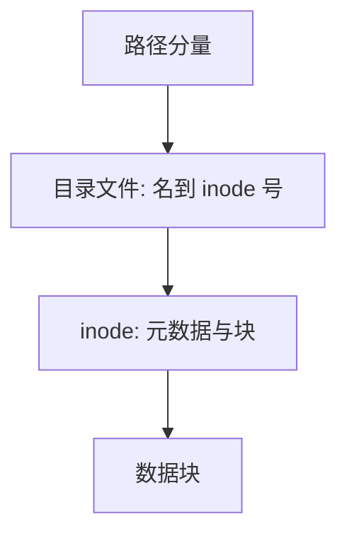

# inode 与目录

inode 记下类型、权限、块指针；目录只是把名字映射到 inode 号的文件。

<footer>—— 据 Thompson, UNIX Implementation；Bach, The Design of the UNIX Operating System 整理</footer>

[上一课](/cs/dcache)让描述符对着字节流，路径还是字符串。缺口是持久编号：**inode** 持有元数据与块地址，目录把分量名译成 inode 号。本课不把脏缓冲与磁盘臂调度写完。

## 问题

若字节流的元数据跟名字绑死，硬链接无法存在：两个名字无法共享同一份块指针。Unix 把「是什么」放进 inode，「叫什么」放进目录项。缺口不是再定义 `read`，而是：路径查找沿目录 inode 走，最后落到目标 inode；打开后描述符抓住 inode（或指向它的打开文件），改名不影响已打开的流。

本课不把现代目录的 B+ 树当唯一实现；经典线性目录足够讲清对象。

inode 含类型（普通、目录、符号链接、设备）、链接计数、时间、权限、大小、直接/间接块指针。链接计数为零且无打开者才回收块。

## 方法

路径 `/a/b`：从根 inode 读目录文件，找 `a` 得目录 inode，再找 `b`。`.` 与 `..` 是目录里的项。硬链接：多条目录项同一 inode 号，计数加一。符号链接是存路径的小文件，查找时再解析。权限在每一层目录与最后 inode 上检查。

## 机制

名字与对象分离，删除名字只减链接；管道与设备也可以有 inode，于是「一切皆文件」有落点。mmap 与 `read` 都经 inode 找页或块。[按需调页](/cs/demand-paging)读文件时，缺的是 inode 指向的块，不是目录字符串。

目录也是文件，所以目录也可被 `read`（历史上）；现代接口用 `getdents`。循环目录（错误的 `..`）由工具检测，内核在 `rename` 时避免把目录挂到自己的子孙下。

## 边界

本课不把 inode 与 NTFS MFT 做成对照表，不引入扩展属性的全部命名空间。也不把崩溃时 inode 与目录项谁先落盘写完——那是日志与后课缓冲的接头，数据库栏已有 WAL，本课文件系统只点「元数据也要一致」。

符号链接有深度上限，防止环。权限沿路径每一目录的搜索位检查，最后才看目标 inode 的读位。

设备号加 inode 号在一台机器上标识对象；跨 NFS 的标识另有文件句柄。

后课默认：路径终于 inode，字节在块里。内存与磁盘之间那层缓存，以及脏了何时写，下一课缓冲与脏页。

## 小结

- inode 是元数据与块指针；目录是名字到 inode 号的文件。
- 硬链接共享 inode；打开抓住对象不抓住路径。
- 块缓存与脏写回是下一课。
- 出处：Thompson, UNIX Implementation；Bach, *UNIX*；Tanenbaum *MOS*。
