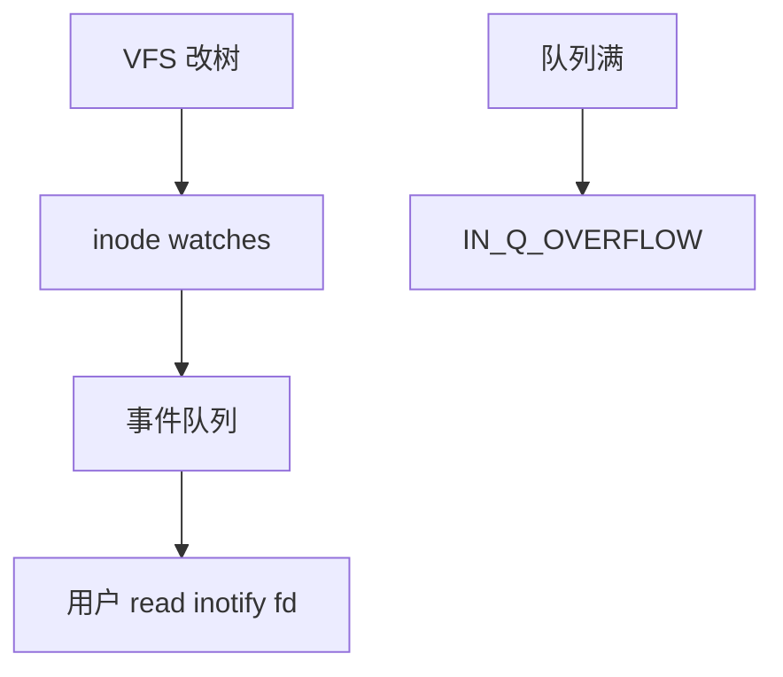

# inotify 与 fanotify

inotify 在 inode 上挂监视器，把 create/modify/delete 编成用户可读的事件队列；fanotify 面向整树扫描与访问许可钩子。

<footer>—— 据 Linux inotify(7)、fanotify(7)；Love, <em>Linux System Programming</em> 对目录事件的整理</footer>

[上一课](/cs/file-locking)让自愿者互斥。备份、IDE、安全扫描还想**不轮询**地知道树变了。缺口是 inotify：内核在 [VFS](/cs/vfs) 操作成功后排队事件。fanotify 是更粗的、可拦截的亲戚。

## 问题

`stat` 轮询浪费，且有窗口。inotify：对 fd 或路径加 watch，掩码选 `IN_CREATE` 等。事件带 name（目录 watch 时）与 cookie（配对 rename）。队列有上限，溢出得 `IN_Q_OVERFLOW`，之后状态未知必须重扫。缺口：递归必须自己对每个子目录加 watch；不穿越挂载点；与 [overlay](/cs/overlayfs) copy-up 的事件可能令人惊讶。fanotify 可对整挂载标记，并可 `FAN_ACCESS_PERM` 允许/拒绝——那是安全钩，不是 IDE 补全。

递归与「文件还是目录」要应用自己处理。网络 FS 上事件可能丢失或不支持。本课不把 inotify 写成 GUI 框架文档。

## 方法

`inotify_init1` 得 fd，`inotify_add_watch` 把 watch 挂到 inode。VFS `mkdir`/`unlink`/`write` 路径末尾向监视器投递。用户 `read` 该 fd 得二进制事件。对照 [FUSE](/cs/fuse)：用户态 FS 必须自己决定是否生成内核可转发的事件。对照 dcache：watch 的是 inode，名字事件来自目录操作。

## 机制

inotify 把「目录是文件」的修改变成可 select/poll 的流，使桌面搜索与同步工具可事件驱动。它不提供事务：事件序列不是 FS 日志的提交切面，崩溃中间仍要以盘为准。不要把事件流写成数据库 CDC。

fanotify 的许可钩进入 LSM 一类决策点，延迟与拒绝策略属于安全课序，本课只点「能挡」。

实现上：递归监视要自己对 mkdir 事件加 watch，否则新子树静默。队列溢出后必须全量重扫，不能当事务日志 replay。fanotify 的许可钩会把打开路径变成同步决策点，延迟进关键路径。 读法上只引用[上一课](/cs/file-locking)的结论，不把对象换成训练推理或限价簿。

本课在操作系统进阶的「文件系统实现 / 接口进阶」课序里，对象是 **inotify 与 fanotify**。

- 先修只引用，不重导：上一课的结论当公理，本课只补差。
- 五栏不吞并：不把本课写成大模型训练/推理，也不写成限价簿或权重量化。
- 文献用 OSTEP、McKusick、内核文档与具名会议论文；不发明 arXiv 编号。

## 边界

本课不引入 `fsnotify` 内部扇出到 audit 的全部钩子。不保证 chroot 内外的 watch 可见性故事写完。下一课把「换名」从事件里抽出，专钉 POSIX `rename` 的原子性。

版本字段会变，课序钉的是机制对象「inotify 与 fanotify」，不是某一主线内核的结构体名。
后课默认：用户态可订阅 inode 事件，队列会溢。同一目录项换名是否原子可见，下一课 rename。

## 小结

- inotify 按 inode 排队目录/文件事件；会溢出。
- fanotify 面向挂载级监视与可选许可。
- rename 原子性是下一课。
- 出处：Linux `inotify(7)`、`fanotify(7)`；Love, *LSP*。
