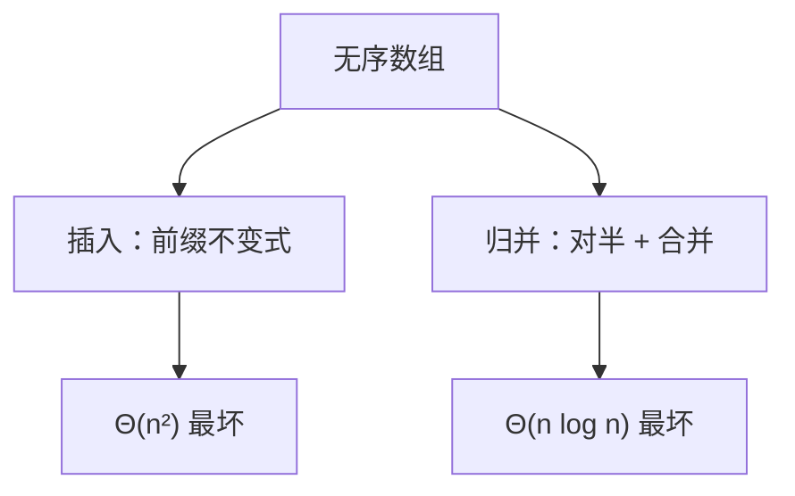

# 插入与归并

插入把已排序前缀一次延长一个元素；归并把两个已排序序列线性扫成一条。

<footer>—— 据 Knuth, The Art of Computer Programming, vol. 3, Sorting and Searching；CLRS 第 2 章整理</footer>

上一课[二分查找](/cs/binary-search)钉了分解–递归–合并。[循环不变式](/cs/loop-invariant)钉了前缀扩大。本课不重讲这两套骨架。缺口是：排序作为第一份具体算法，需要同时看见**迭代的插入**和**分治的归并**，否则后课堆排、快排没有对照。本课只处理比较排序里这两端。

## 问题

无序数组要变成非降序列。插入：第 $i$ 轮开始时 $A[1..i-1]$ 已排序，把 $A[i]$ 插进正确位置。不变式就是这条前缀。最坏每次挪 $i$ 格，$\Theta(n^2)$。归并：对半切开，递归排序，再用 $\Theta(n)$ 双指针合并。主定理情形二给出 $\Theta(n\log n)$。

缺口不是「什么是排序」，而是这两套正确性与代价必须并排：一个用循环不变式，一个用分治归纳。稳定性：相等键相对次序，插入与归并都可以稳定；后课堆排默认不稳。

### 归并不是插入的加速版

插入几乎不占额外数组；归并通常要 $\Theta(n)$ 缓冲。近乎有序时插入是 $\Theta(n)$，归并仍是 $\Theta(n\log n)$。没有「永远更快」这一方。Knuth 把两者都当作内排的基本动作，外存归并另算块 I/O，本课不展开。

冯·诺依曼 1945 年前后的归并程序是分治排序的源头之一。CLRS 用插入练不变式、用归并练递归。本课保持这个分工。

## 方法

插入：从左到右，内层把大于键的元素右移。终止时 $i=n+1$，整表有序。归并：`sort(L); sort(R); merge(L,R)`。`merge` 的不变式是：输出前缀已是两输入前缀的有序合并，指针只前进。

比较只在键之间进行。后课线性时间排序会动用值域，本课仍在比较模型里。

## 机制

插入的内层是线性搜索或（折半找位置仍要挪元素）$\Theta(n^2)$ 移动下界在最坏数据上仍在。归并的深度 $\Theta(\log n)$，每层总合并 $\Theta(n)$。额外空间与缓存行为不同：插入紧凑，归并扫两段再写回，[局部性](/cs/locality-principle)上各有利弊，本课不量化 Cache。

## 边界

本课不证比较排序的 $\Omega(n\log n)$，那是[下界](/cs/sort-lower-bound)。不引入堆。不处理链表归并的指针版——表示已在[链表](/cs/linked-list-locality)，算法骨架相同。也不把 Timsort 的 run 探测写进来，那是工程附录。

后课默认：插入 = 前缀不变式 + $\Theta(n^2)$；归并 = 分治 + $\Theta(n\log n)$ + 线性额外空间。堆排序用[堆](/cs/heap-priority)换掉缓冲。

## 小结

- 插入用循环不变式，最坏平方；近乎有序则线性。
- 归并用分治，最坏 $n\log n$，通常要线性额外空间。
- 两者都可以稳定；对照的是骨架与资源，不是「谁过时」。
- 出处：Knuth, TAOCP vol. 3；CLRS 第 2 章。
