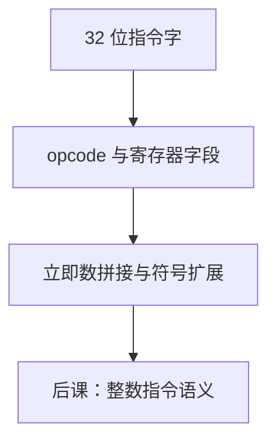

# 指令格式

取出来的 32 比特必须切成操作码与寄存器号；字段位置固定，译码才是简单的组合接线。

<footer>—— 据 Patterson and Hennessy, Computer Organization and Design (RISC-V) 整理</footer>

上一课[哈佛与冯·诺依曼](/cs/harvard-von-neumann)钉死了指令作为内存中的比特。本课不重讲 PC，也不从 x86 变长指令另起。缺口是：一串 32 位还没有字段。后课译码器、寄存器堆端口、立即数符号扩展，都要知道**哪几位是什么**。本栏从此以 RISC-V 为运行 ISA。

## 问题

任意切分都能编号，但硬件希望：操作码位置固定、寄存器号对齐，以便[译码器](/cs/decoder-encoder)与读口硬连。缺口因此不是再解释存储程序，而是 RISC-V 的几种 32 位格式：R/I/S/B/U/J。`opcode` 总在 `[6:0]`，`rd`/`rs1`/`rs2` 位置尽量固定，立即数按类型拼接并符号扩展——编码不是「人好看」，而是译码便宜。

压缩 16 位 `C` 扩展、64 位指令空间不进本课。特权指令的 `csr` 字段后置。

### 立即数不是「指令里的无符号整数」

分支与 JAL 的立即数是编码过的偏移，最低位隐含 0（半字/字对齐）。按无符号读 I 型立即数会把负数偏移变成大正数。符号扩展规则来自[补码](/cs/twos-complement)，本课只声明哪一种格式要扩展。

Patterson/Hennessy 用一张图列六种格式。RISC-V 刻意让 `rs1`、`rd` 在 I 与 R 中同位，避免译码 MUX 数据路径。本课不把全部 opcode 表抄完，那是下一课整数指令。

## 方法

R 型：`funct7`、`rs2`、`rs1`、`funct3`、`rd`、`opcode`。I 型用 12 位立即数替换 `funct7+rs2`。S/B 把立即数拆开以保持 `rs1`/`rs2` 位置。U/J 的宽立即数占满高位。译码：先看 `opcode`，再看 `funct3`/`funct7`。

## 机制

固定字段让单周期数据通路可以把指令位直接接到寄存器堆地址口，不必先用组合「解析器」重排（除立即数拼接）。变长 ISA 要先确定长度，取指就可能多拍。本栏不把 x86 当主干对照课。

非法编码：未定义 `opcode` 应进后课异常，而不是当 $X$ 化简掉——若 CPU 必须 traps。

## 边界

本课不讲微码把复杂指令拆成格式；RISC-V 整数核几乎一条指令一种组合路径。不把 ABI 寄存器别名（`sp`、`ra`）提前到调用约定课以外的语义——别名是约定，字段仍是 5 位编号。

后课默认：指令 32 位，RISC-V 六种格式；寄存器号 5 位，32 个整数寄存器。语义下一课。

## 小结

- 存储程序的比特按 RISC-V 字段切开。
- `opcode`/`rd`/`rs1`/`rs2` 位置固定，译码是组合。
- 立即数按类型拼接并通常符号扩展。
- 出处：Patterson and Hennessy, COD (RISC-V)。
