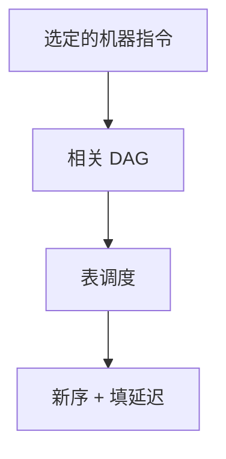

# 指令调度

数据相关与延迟槽决定指令不能任意换序；表调度在基本块内按就绪队列选下一条，缩短占用周期，不改语义。

<footer>—— 据 Hennessy and Gross, Postpass Code Optimization of Pipeline Constraints, 1983；龙书第 8 章；组成课流水线整理</footer>

上一课[指令选择](/cs/instruction-select)交出带虚拟寄存器的机器指令，并声明不排流水线。组成课已有[数据冒险](/cs/data-hazard-forward)与[五级流水](/cs/pipeline-five-stage)。本课不重选 opcode。缺口是**块内换序**：load 的延迟、乘的延迟、真相关 $x$ 写后读，把指令排成就绪表。寄存器分配尚未发生，调度可与分配交错；主干先调度再着色，或承认二者互相影响。

## 问题

选择后的序列合法，但相邻 `lw` 与用其结果的 `add` 会停顿。表调度：节点是指令，边是真/反/输出相关，权是延迟。就绪队列里挑使关键路径不拉长的指令发射。缺口是这份 DAG 调度，不是再做转发硬件。

反相关与输出相关在虚拟寄存器无限时可靠改名削弱；真相关不能消。分配之后物理寄存器会再引入相关，可能要再调度或保守留空。本课以虚拟名上的表调度为对象。

### 调度不是超标量发射

超标量硬件同时发多条；本课是编译器静态排单发射或静态 VLIW 槽。组成课的[多发射](/cs/superscalar-issue)是硬件；本课不代替 Tomasulo。

Hennessy–Gross 1983 流水约束后处理。龙书 8.10 节指令调度。Appel 有短章。本课块内；跨块（追踪调度）点名不写。

## 方法

建依赖 DAG。拓扑就绪：入度为零。循环：选优先（高度、延迟加权），更新子节点。插 nop 或让硬件停顿——视目标是否暴露延迟槽（经典 MIPS）而定。RISC-V 常靠硬件互锁，调度仍减停顿。

[循环不变式](/cs/loop-invariant) 外提是另一遍，可在调度前把不变 load 提出块。本课块内不保证最优：表调度是启发式，最优调度难。

## 机制

正确性：尊重真相关与内存别名（保守：可能别名则当相关）。volatile 与调用是屏障。不要调度过可能抛的指令而不顾异常顺序——精确异常要求可见状态；本课整数运算默认可动，访存保守。

与着色：调度拉长同时活区间，冲突图变密，可能多溢出。这是交错的来源，下一课溢出再处理。

## 边界

本课不着色、不写窥孔代数。不做软件流水满堂。后课默认：块内指令序已考虑延迟。冲突图着色把虚拟收成物理或 spill。

## 小结

- 表调度按相关 DAG 与延迟排块内序。
- 真相关不能改名消掉；别名保守当边。
- 可能加长活跃区间，留给分配。
- 出处：Hennessy and Gross, 1983；龙书第 8 章。
