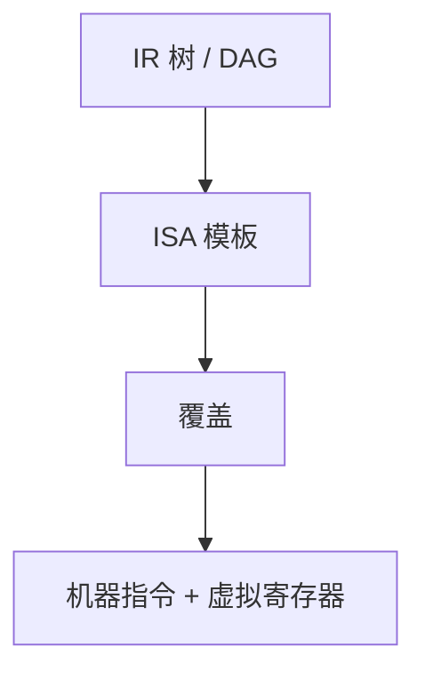

# 指令选择

把 IR 运算树（或 DAG）盖上目标机的指令模板；同一树可以有多种覆盖，代价不同。

<footer>—— 据龙书第 8 章；Aho, Ganapathi and Tjiang, Code Generation Using Tree Matching, 1989 整理</footer>

上一课[可用表达式](/cs/available-expr)仍在虚拟名上。本课不着色。缺口是：三地址的 `+`、`load` 要变成[RISC-V 整数指令](/cs/riscv-int-isa)或另一 ISA 的具体 opcode。选择可以局部树匹配，也可以 tiling。寄存器还当无限，名字仍是虚拟的。

## 问题

IR 是目标无关的。`t3 <- t1 + t2` 在 RISC-V 是 `add`，在 CISC 可能是带访存的一条。缺口是模板：树模式 $\leftrightarrow$ 指令 + 代价。最大吞或动态规划选最小代价覆盖。本课用树模式直觉，不写完整 BURG 生成器。

组成课已有指令格式与寄存器堆；本课只问「哪条指令实现这个 IR 节点」。调用序列的参数寄存器留给 ABI。

### 选择不是分配

选出 `add rd, rs1, rs2` 仍带虚拟寄存器。分配把虚拟映到 `x10` 或溢出。顺序通常先选后分配，或二者交错；主干先选。窥孔还可以在选完后改写。

龙书 8.9 节树重写。Aho–Ganapathi–Tjiang 的树匹配。RISC 上选择往往接近 1:1，CISC 上 tiling 收益大。本课两边都承认。

## 方法

把基本块内 IR 看成森林/DAG。对每个根，用动态规划或贪婪匹配盖模板。访存指令带宽度，来自类型课的 size。非法组合（未对齐）按 ABI 与 ISA 拒绝或拆成多条。

[指令格式](/cs/instruction-format)决定立即数能否塞进一条；放不下则先 `lui`/`addi` 一类，仍是选择。

## 机制

代价：周期或长度。错误选择会多指令，不一定错语义。副作用（标志位）在 CISC 上要进模板。RISC-V 整数子集本课够用；浮点、向量不在本课。

与超标量、流水线课：选择可以避开已知冒险对，但不代替分配与调度。本课不排流水线调度。

## 边界

本课不填着色、不写调用惯例细节、不做全局指令调度。窥孔是更窄窗口的本地改写，后两课才到。后课默认：虚拟寄存器机器指令已选出。冲突图着色把虚拟收成物理寄存器或溢出。

## 小结

- 指令选择 = ISA 模板覆盖 IR；代价可选优。
- 输出仍含虚拟寄存器。
- RISC 近 1:1；复杂 ISA 才显 tiling。
- 出处：Aho et al., 龙书第 8 章；Aho, Ganapathi and Tjiang, 1989。
