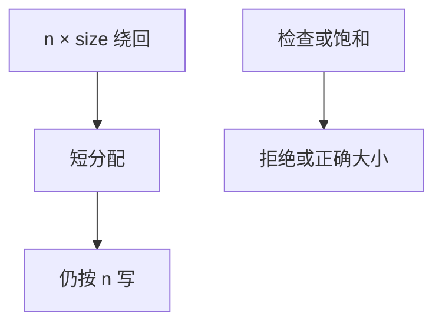
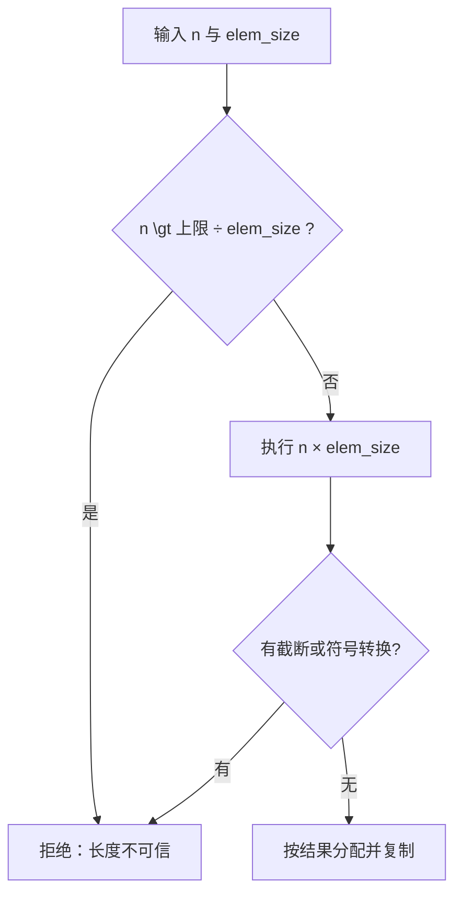

# 整数溢出漏洞

长度先用机器整数算，再拿去 `malloc` 和 `memcpy`。绕回零的乘会分到短缓冲再写长数据。这是类型与宽度问题，不是「再加一个 canary」能定义的。

<footer>—— 据 Brumley, Chiueh 等对整数错误的讨论；CWE-190；对照 ISO C 对无符号绕回</footer>

上一课[分配器](/cs/heap-allocator-attacks)假定请求的大小是诚实的。缺口是**算术**：宽类型截断、有符号转无符号、乘法溢出。本课讲检查应在算术层，不给绕过补丁的步骤。

后课默认已经读完本课钉下的合同，只补差，不从该领域第一性原理重开。

## 问题

`n * size` 绕回后分配很小，循环仍按 `n` 写。缺口是：所有「计数→字节」的边都要饱和或显式检查。语言若提供检查乘法，应默认用。

数字实例：32 位无符号整数的上限是 $2^{32}-1$。若每个元素 4 字节、`n` 取 $2^{30}$，乘积恰是 $2^{32}$，绕回后等于 0——`malloc(0)` 拿到极小的合法内存，程序随后却按 10 亿个元素往里写。

### 有符号与无符号

比较两边类型不同会让「负长度」变成巨大无符号，另一类洞。

术语翻译：「截断」就是把宽类型的数硬塞进窄类型、只保留低位：把 0x10001 塞进 16 位类型只剩 0x0001，数值被悄悄改掉；而「符号转换」则是把 -1 这类负数读成无符号，直接变成约 42 亿。

CWE-190/191。本课不写触发某 CVE 的输入。编译器未定义行为对有符号溢出另有坑，点名[未定义行为](/cs/undefined-behavior-opt)。

## 方法

列出转换点：乘法、加法、截断、符号。要求 API 用更大类型或饱和。对照：格式化字符串下一课是另一类「解释用户串当格式」。

```mermaid
flowchart TD
  MUL["n × size 绕回"] --> SMALL["短分配"]
  SMALL --> COPY["仍按 n 写"]
  CHK["检查或饱和"] --> OK["拒绝或正确大小"]
```

## 机制

空间安全的输入是长度。长度不可信则分配器与复制都不可信。下一课格式化字符串：控制解释器而不是长度。

检查要放在「算出长度」的那几步算术上，而不是等分配完再补救。

```mermaid
flowchart TD
  IN["输入 n 与 elem_size"] --> C1{"n \gt 上限 ÷ elem_size ?"}
  C1 -->|"是"| R["拒绝：长度不可信"]
  C1 -->|"否"| M["执行 n × elem_size"]
  M --> C2{"有截断或符号转换?"}
  C2 -->|"有"| R
  C2 -->|"无"| A["按结果分配并复制"]
```

常见误区：初学者容易以为加个 canary 或事后校验缓冲区就能挡住这类洞；实际上绕回发生在「算出长度」那一刻，等 `malloc` 收到那个虽错误却「合法」的小值，后续防线已经无从知道真实长度了。

## 边界

本课不给整数溢出 exploit。格式化字符串下一课同样只讲机制与禁用。

## 小结

- 分配器收到的 size 可能已被绕回。
- 计数到字节必须检查宽度。
- 符号转换是同类洞。
- 下一课格式化字符串。
- 出处：CWE-190；ISO C；Brumley et al. 对整数错误的分析。
