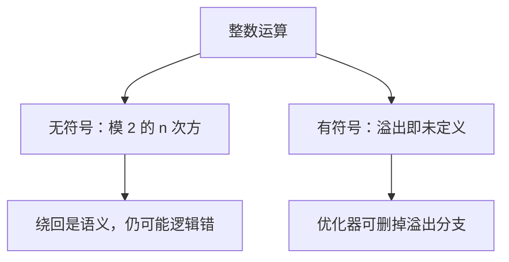

# 整数溢出

无符号运算在模 $2^n$ 上闭合；有符号溢出不在这个闭合里——标准把它留给未定义行为，而不是留给「绕回」。

<footer>—— 据 ISO/IEC 9899；Kernighan & Ritchie, The C Programming Language, 2nd ed.；Bryant and O'Hallaron, Computer Systems: A Programmer's Perspective 整理</footer>

上一课[未定义行为](/cs/undefined-behavior)把「离开抽象机器」收成总规则。本课不重列附录 J，也不从比特编码另起——补码怎么排是信息课的缺口。缺口是：日常加减看起来像数学整数，**C 的 `int` 与 `unsigned` 在越界时走的不是同一条规则**。把两条混成「都会 wrap」，优化器会删掉你的溢出检查。

## 问题

机器字宽有限。无符号类型的加减乘在标准里定义为模 $2^n$，绕回是语义，不是事故。有符号类型的溢出是 UB：实现可以绕回，也可以陷入，也可以让编译器假设「有符号加减永不溢出」从而把 `if (a + 1 < a)` 整段删掉。缺口因此不是「整数有范围」，而是**哪一种溢出仍有定义**。前面栈与数组课里的下标计算，很多从这里开始悄悄变成 UB。

本课只谈 C 的整数类型在表达式中的溢出。移位、除零、从无符号到有符号的转换另有规则，点到为止：负值右移是实现定义；移位位数不小于宽度是 UB。后课信息与离散会把补码表示讲清；这里先把语言契约钉死，避免用「硬件会 wrap」去写源码。

### 无符号绕回不是「更安全」

模运算有定义，不表示逻辑正确。长度相减得到巨大的 `size_t`、分配尺寸绕回，是真实漏洞模式。有符号用更宽类型或先检查再运算；无符号要用模的代数来想，而不是当成不会错的自然数。也不要把 `char` 默认有符号当成可移植事实——那是实现定义。

CSAPP 第 2 章用模 $2^w$ 讲无符号与补码算术，并强调 C 对有符号溢出的处理与硬件指令不必相同。ISO C 把无符号规定为绕回，把有符号溢出规定为 UB，正是为了让优化器利用「数学整数」的不等式。

## 方法

先看操作数在整数提升与常规算术转换之后的类型，再判断是否无符号。需要可移植的溢出检查时：对无符号，用模前的不等式（如 `a > UINT_MAX - b`）；对有符号，用更宽类型或标准库即将提供的检查接口，避免先算出已经溢出的结果再判断。循环下标用无符号时，倒数到 0 的 `--` 会绕回，终止条件要按模来写。

`size_t` 无符号。对象大小、数组长度相减优先用无符号规则思考。需要差值可能为负时，先转成有符号宽类型，并保证输入在范围内。

提升规则会在运算前把较小类型变成 `int`，于是 `uint16_t` 相乘可能在有符号 `int` 上溢出——这是语言，不是硬件字宽。写固定宽度算术时要先看运算在哪种类型上进行。后课悬挂会从「尺寸绕回导致分配过小、随后写爆」接过来。信息与离散课会把补码表示讲清；在那之前，本课禁止用「寄存器里反正 wrap」来为有符号 C 辩护。无符号绕回是模运算，要真当模来用，例如环形缓冲下标。

## 机制

优化器若允许假设有符号永不溢出，就可以把计数器递增写成更简单的归纳，把看似多余的范围检查当死代码。这与上一课的机制是同一件事，只是对象从指针换成了整数。无符号没有这条假设，所以同一套检查写成无符号时可能「恰好」留下；这不是风格胜利，是两类语义不同。

后课信息课会说明：硬件上有符号加法与无符号加法往往是同一条指令，只是标志位解释不同。语言选择把有符号溢出从这条指令的绕回里摘出去，是为了抽象机器，不是因为 ALU 算不了。

移位与乘积是同一契约的延伸：把长度算成字节数时 `n * sizeof *p` 若用有符号 `int` 装 `n`，乘法可能 UB，再传给 `malloc` 时已经离开语言。无符号包装会给出过小的分配尺寸，随后的写入越界——从溢出走进悬挂与越界两条后课。循环 `for (int i = 0; i <= n; i++)` 在 `n == INT_MAX` 时也可能溢出。信息课将说明硬件上加减常常不分有无符号；本课要记住：语言在有符号一侧故意不认那条绕回。

## 边界

本课不讲 IEEE 浮点溢出，那是数值课与 [IEEE 754](/cs/ieee-754) 的事。也不把补码位型重推一遍。下一课[生命周期与悬挂](/cs/lifetime-dangling)回到对象寿命。后课默认：无符号绕回有定义；有符号溢出是 UB；不能用一次硬件观察代替标准。

## 小结

- 无符号算术模 $2^n$；有符号溢出是未定义行为。
- 硬件绕回不能当作有符号 C 的语义。
- 长度与下标计算要先分清类型，再写检查。
- 下一课处理指针在对象死后仍被使用的问题。
- 出处：ISO C 整数语义；CSAPP 第 2 章；K&R 类型与算术。
