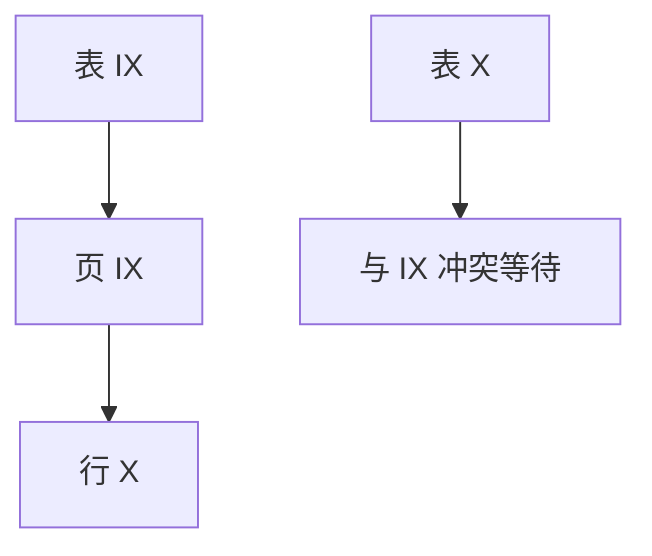

# 意向锁与粒度

要锁一行，先在表上挂意向：别人想锁整表时能看见冲突，而不必枚举所有行锁。

<footer>—— 据 Gray, Lorie, Putzolu and Traiger 多粒度锁，1975；Gray and Reuter；Ramakrishnan and Gehrke</footer>

[上一课](/cs/ssi)在行版本上追踪冲突。本课回到悲观锁的**粒度**：行、页、表。主干 2PL 常默实行锁。缺口是多粒度：若只行锁，全表扫描的互斥要百万把锁；若只表锁，并发为零。意向锁（IS/IX）在祖先上做标记。

## 问题

层次：数据库–表–页–行。事务要 X 锁行：先 IX 表、IX 页，再 X 行。另一事务要 X 表：与 IX 冲突，等待，不必看每一行。缺口是**相容矩阵**：IS 与 IX 相容，X 与一切意向在同对象上冲突等。锁升级：行锁太多则升表锁，减少内存，增加冲突。

与 latch：latch 仍短、在页结构上；意向锁是事务锁，可持有到提交（严格 2PL）。

Gray et al. IBM 多粒度。SQL Server、DB2、InnoDB 都有表/行意向。Postgres 行锁+表级 ACCESS SHARE 等是另一套名字，机制同族。

## 方法

加锁自上而下，释放自下而上（或提交一次性），避免死锁协议破环。查询计划决定粒度：全表更新应直接表锁，不要先锁每一行再升级。优化器与锁：顺序扫描仍可能行锁，HOT 更新同页。

覆盖：意向不替代行上的 X；它是祖先上的警告灯。

## 机制

死锁：两事务对表与行反序仍可环，wait-for 下一课。SSI 的 SIREAD 也是一种范围意向。分区表：锁可停在分区级。

内存：锁表项数是容量。升级阈值是调参。计划回归：突然表锁把并发打穿，像优化器选了全表更新路径。

## 边界

本课不讲 next-key。也不把文件锁当意向。分布式锁粒度更粗，后课。

后课默认：行锁路径必先意向祖先。间隙锁与谓词锁：防幻象的范围，不只点行。

没有意向，表级互斥只能靠「锁所有行」或「总是表锁」两端。

## 小结

- 多粒度用 IS/IX 标记祖先，使表锁与行锁可检测冲突。
- 加锁自上而下；升级是容量阀门。
- 间隙锁与谓词锁下一课。
- 出处：Gray et al. 1975；Gray and Reuter；Ramakrishnan and Gehrke。
