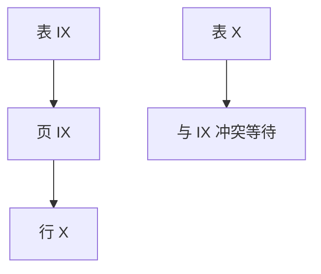
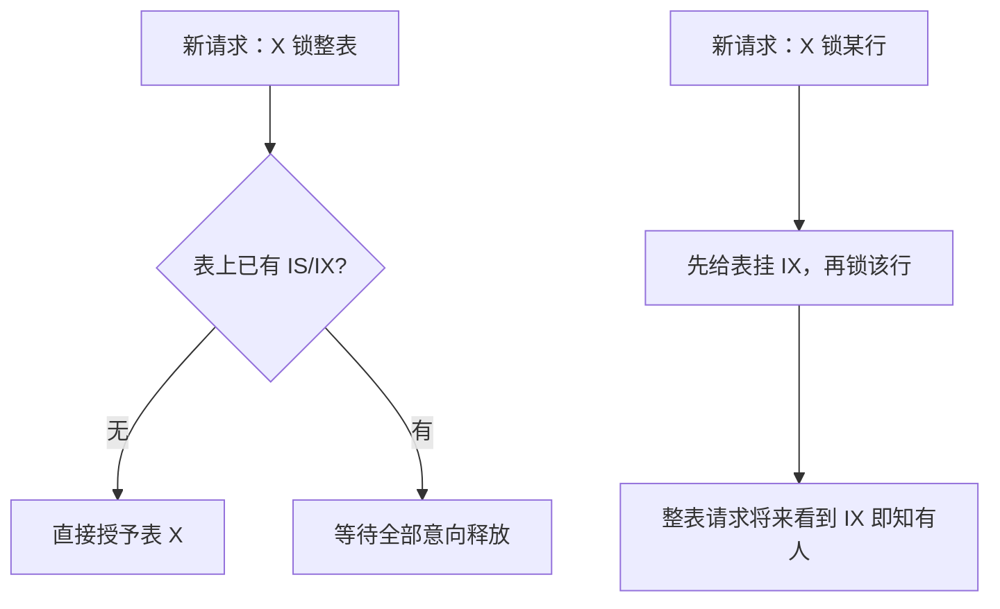

# 意向锁与粒度

要锁一行，先在表上挂意向：别人想锁整表时能看见冲突，而不必枚举所有行锁。

<footer>—— 据 Gray, Lorie, Putzolu and Traiger 多粒度锁，1975；Gray and Reuter；Ramakrishnan and Gehrke</footer>

[上一课](/cs/ssi)在行版本上追踪冲突。本课回到悲观锁的**粒度**：行、页、表。主干 2PL 常默实行锁。缺口是多粒度：若只行锁，全表扫描的互斥要百万把锁；若只表锁，并发为零。意向锁（IS/IX）在祖先上做标记。

## 问题

层次：数据库–表–页–行。事务要 X 锁行：先 IX 表、IX 页，再 X 行。另一事务要 X 表：与 IX 冲突，等待，不必看每一行。缺口是**相容矩阵**：IS 与 IX 相容，X 与一切意向在同对象上冲突等。锁升级：行锁太多则升表锁，减少内存，增加冲突。

术语翻译：IS＝「我打算在下面加共享锁」，IX＝「我打算在下面加排他锁」。它们自己不锁任何数据，只是挂在祖先（表、页）上的告示牌，让粗粒度请求不必枚举全部细粒度锁。

与 latch：latch 仍短、在页结构上；意向锁是事务锁，可持有到提交（严格 2PL）。

Gray et al. IBM 多粒度。SQL Server、DB2、InnoDB 都有表/行意向。Postgres 行锁+表级 ACCESS SHARE 等是另一套名字，机制同族。

## 方法

加锁自上而下，释放自下而上（或提交一次性），避免死锁协议破环。查询计划决定粒度：全表更新应直接表锁，不要先锁每一行再升级。优化器与锁：顺序扫描仍可能行锁，HOT 更新同页。

覆盖：意向不替代行上的 X；它是祖先上的警告灯。

直觉类比：意向锁像楼层门口的「楼内有人」指示灯——你想给整层断电（表锁），不必挨个房间查看，瞄一眼门口的灯就知道里面有没有人；每个进房间的人（行锁）进门时先按下这盏灯。

```mermaid
flowchart TD
  TAB["表 IX"] --> PG["页 IX"]
  PG --> ROW["行 X"]
  TAB2["表 X"] --> WAIT["与 IX 冲突等待"]
```

## 机制

死锁：两事务对表与行反序仍可环，wait-for 下一课。SSI 的 SIREAD 也是一种范围意向。分区表：锁可停在分区级。

授予判定怎么做到「不枚举行锁」：只看同对象上的已有标记。

```mermaid
flowchart TD
  REQ["新请求：X 锁整表"] --> C{"表上已有 IS/IX?"}
  C -->|"无"| G["直接授予表 X"]
  C -->|"有"| W["等待全部意向释放"]
  REQ2["新请求：X 锁某行"] --> I["先给表挂 IX，再锁该行"]
  I --> G2["整表请求将来看到 IX 即知有人"]
```

数字实例：一张 100 万行的表，没有意向锁时，互斥地全表更新得逐行比对 100 万把锁；有了表级 IX 标记，查一次表就够。反过来若总是用表锁，100 个各读一行的事务也只能完全排队——两端都不划算。

内存：锁表项数是容量。升级阈值是调参。计划回归：突然表锁把并发打穿，像优化器选了全表更新路径。

## 边界

本课不讲 next-key。也不把文件锁当意向。分布式锁粒度更粗，后课。

后课默认：行锁路径必先意向祖先。间隙锁与谓词锁：防幻象的范围，不只点行。

没有意向，表级互斥只能靠「锁所有行」或「总是表锁」两端。

## 小结

- 多粒度用 IS/IX 标记祖先，使表锁与行锁可检测冲突。
- 加锁自上而下；升级是容量阀门。
- 间隙锁与谓词锁下一课。
- 出处：Gray et al. 1975；Gray and Reuter；Ramakrishnan and Gehrke。
