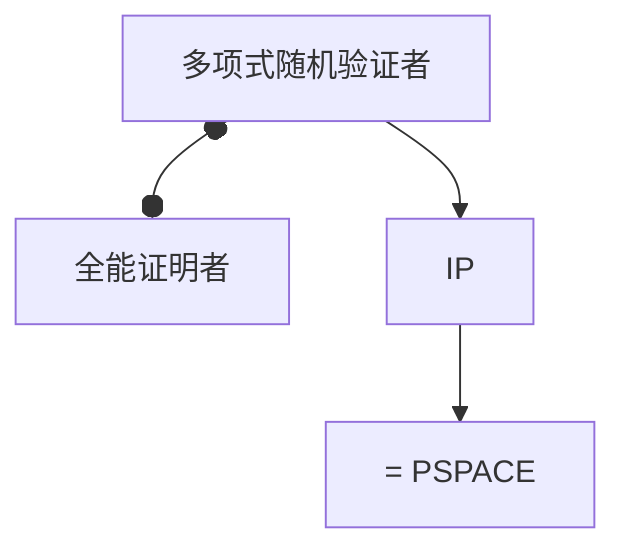

# 交互证明与 IP = PSPACE

验证者多项式、可掷硬币，与全能证明者回合交谈；IP 恰好等于 PSPACE。图不同构因此有交互证明。

<footer>—— 据 Goldwasser, Micali and Rackoff；Shamir, IP = PSPACE, 1992；Arora and Barak 整理</footer>

上一课[BPP](/cs/bpp-randomized-class) 的硬币只在一台机器里。缺口是**交互**：证明者 $P$ 无限能，验证者 $V$ 多项式随机，多轮消息。完备：是实例 $V$ 几乎总接受；可靠：否实例任意 $P^*$ 几乎总被拒。$\mathrm{IP}=\mathrm{PSPACE}$（ Shamir）。GNI（图不同构）在 IP 里，却未知是否在 NP——短证书与交互不是一类。

## 问题

NP 是一轮、确定性验证的证书。交互允许：隐藏随机挑战、自适应问题。求和检查、算术化把布尔改成多项式，验证者抽随机点比较。#SAT 的计数证明可放进 IP，从而 PSPACE（TQBF）也可。本课要这层归约直觉，不写 Shamir 的全部多项式。

公开随机（Arthur–Merlin）与私硬币在足够轮数下能力接近，点名 AM。一轮公开随机大致在 PH 的第二层附近。

### 交互不是「口头 NP」

证明者不能被相信：可靠对恶意 $P^*$ 成立。零知识是额外性质（模拟），本课不定义 ZK 协议，只声明 IP 的类不等于「有 ZK 证明」。

GMR 交互证明。Shamir 1992；Lund–Fortnow–Karloff–Nisan 的 #SAT。Sipser 有简写。本课不引入 MIP = NEXP。

## 方法

用图不同构：验证者随机藏一张图的随机重标，问证明者来自 $G$ 还是 $H$。不同构则证明者能分；同构则无法优于猜测。说明为何这不是 NP 证书（验证者必须藏随机性）。再点名：算术化把 PSPACE 送进 IP。

## 机制

$\mathrm{NP}\subseteq\mathrm{IP}$ 显然（证书当消息）。$\mathrm{IP}\subseteq\mathrm{PSPACE}$：空间枚举消息树、递归算接受概率。另一边 Shamir。于是交互恰好填满上一课的 PSPACE，而不是「NP 的随机版」。

轮数、私硬币是精细结构；类的等式在多项式轮下成立。

$\mathrm{IP}\subseteq PSPACE$ 的递归：验证者消息树深度多项式、每层多项式分支，空间可复用。另一边 Shamir 把 TQBF 算术化到有限域多项式，证明者逐步打开求和。GNI 展示交互可以藏随机挑战；NP 证书没有「验证者私硬币」这一资源。

## 边界

本课不写零知识证明实现，不引入密码学假设下的简洁证明。不把 MIP、PCP 混成一轮（PCP 下一课）。后课默认：交互证明的能力是 PSPACE，不是 NP。下一课 PCP 与不可近似。

IP 填满 PSPACE，不是「随机的 NP」。轮数、私硬币是精细结构；类的等式在多项式轮下成立。零知识是额外模拟性质，本课不把 ZK 协议当 IP 的定义。

上一课留下的缺口在本课收口；「交互证明与 IP = PSPACE」进入后课词汇表后只引用。文献用来钉对象与边界，不把本课写成该主题的独立综述。

## 小结

- IP：多项式随机验证者 + 交互；等于 PSPACE。
- GNI 展示「有交互证明 ≠ 已知有 NP 证书」。
- 可靠必须对恶意证明者成立。
- 出处：Goldwasser, Micali and Rackoff；Shamir, 1992。
