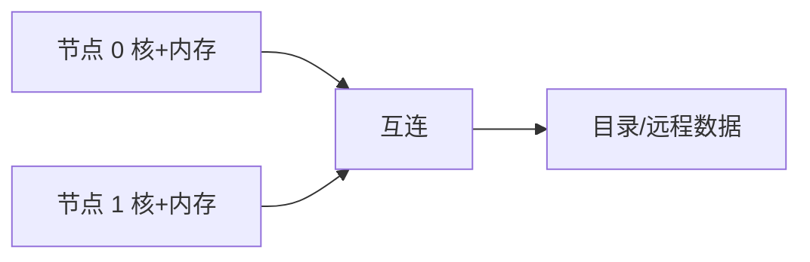

# 互连与 NUMA

核多到无法共享一条总线时，内存贴在不同控制器上；本地命中快，远程要走片上或片间互连。

<footer>—— 据 Hennessy and Patterson, Computer Architecture: A Quantitative Approach 整理</footer>

[上一课](/cs/tso-weak)把可见性写成模型，并假定「全局可见」有一个大致均匀的延迟。[多核与共享缓存](/cs/multicore-shared-cache)用一条抽象互连接到 LLC。[MESI](/cs/mesi-protocol)的窥探广播在核数上升时占满总线。本课不重讲 SC。缺口是：物理上内存和目录必须分区，访问时间不再对称。本课只钉互连与 NUMA，体系结构课在此收束。

## 问题

窥探要求每核每拍看见所有事务，带宽和监听过滤都随核数恶化。内存控制器若只有一套，该点成为热点。[SRAM 与 DRAM 阵列](/cs/memory-array-sram-dram)已经说明通道有限。缺口不是再加一路 L1，而是**拓扑：交叉开关、环、网格；以及内存附着在不同节点上，形成非一致访存时间**。

目录协议把「谁有副本」记在主节点，避免广播。本课承认目录是扩展一致性的手段，不把目录项格式写完。

NUMA 不是取消共享内存，只是把 load 延迟变成「这页在不在本节点」的函数。

## 方法

节点 = 若干核 + 本地 DRAM + 目录切片。远程 load：互连转发，目录找到持有者，必要时转发数据。操作系统尽量把页分配在访问多的节点（亲和），否则 CPI 里出现固定的远程项。

[局部性原理](/cs/locality-principle)多了一层：核间局部性（共享行应在目录与 LLC 上命中）和节点局部性（数据放本地 DRAM）。假共享的代价变成跨互连的 MESI 迁移。

## 机制

顺序一致性或 TSO 仍然可实现，但「全局可见」的物理意义是事务到达目录并完成。栅栏更贵。阿姆达尔：远程比例 $f$ 一旦非零，加核加速被互连封顶。编程上把锁与热点结构放本地，或复制只读。页若落在远端节点，[局部性原理](/cs/locality-principle)的命中仍可能付跨互连的常数。

体系结构主干交到这里：指令能在流水线里跑，存储器层次、一致性和距离都有了名字。还没有给程序员一套与 ISA 无关的「表、栈、图」布局约定——那是下一课程抽象数据类型的缺口。

## 边界

本课不进入网络课的路由拥塞控制，不把 QPI/UPI 型号当正文。也不把 NUMA 写成「没有共享内存」：地址仍全局，只是延迟分档。GPU 多设备互连不在本栏展开。

后课默认：访存延迟依赖页在哪一节点。数据结构课开始时，假定这些指令与层次已经会执行。

## 小结

- 总线窥探不可任意扩展；目录加互连分区内存。
- NUMA：同一物理地址，本地与远程延迟不同。
- 体系结构课结束；下一课开始命名可复用的比特布局。
- 地址仍全局共享；NUMA 只把延迟分档。
- 出处：Hennessy and Patterson, *CA:AQA* 互连与目录一致性。
