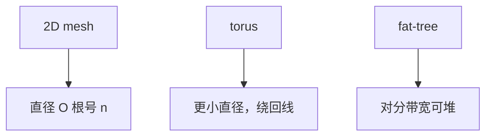

# 互连拓扑：mesh / torus / fat-tree

网格好铺硅、直径随边长涨；环面把边接回去减直径；胖树把拥塞赶到可加宽的上层，代价是层次与线长。

<footer>—— 据 Dally and Towles；Leiserson, Fat-Trees, IEEE TC 1985 整理</footer>

[上一课](/cs/noc-topology) 有了路由器，没说连成什么图。拓扑决定直径、对分带宽、以及目录 home 的最坏跳数。本课不重讲 flit。缺口是 **mesh、torus、fat-tree 的几何与它们适合片上还是机柜。**

## 问题

$n$ 个 tile：全连接不可能。二维 mesh：每个内部节点 4 邻居，布线规则，直径 $O(\sqrt{n})$，边角节点对分带宽窄。缺口不是再加虚通道定义，而是**选图：延迟敏感的一致性要小直径，带宽敏感的 DMA 要对分带宽。**

Torus：mesh 的边绕回，直径减半，绕回线更长。Fat-tree：叶子是计算节点，向上链路加宽，Leiserson 用来逼近无阻塞。片上多用 mesh，机柜/超算多用 fat-tree 或类似。

## 方法

比较：度（路由器端口数）、直径、对分、是否规则布线。片上 mesh 与 tile 物理布局同构，几乎零交叉。Fat-tree 需要长线到根，片上难，片间交换机合适。多级交叉开关是胖树近亲。

## 机制

目录协议的延迟 ∝ 跳数 × 每跳（争用）。热点 home 在 mesh 中心还是角落，体验不同，所以地址哈希要均匀。GPU 的片上交叉或 mesh 服务 SM 到 L2；CPU 服务器 mesh 服务 LLC slice。多 socket 下一课之后才出芯片。

对分带宽决定「一半 tile 同时与另一半通信」时的上限，全 reduce、全交换一类集体操作吃这个。mesh 的对分随边长线性，节点数平方时每节点份额下降——这是弱扩展仍可能通信饱和的几何原因。

## 边界

本课不把龙芯/某款网的商标当拓扑课。路由算法与死锁下一课才禁止环。不要写成交易所网络。

后课默认：片上默认想 mesh 一类规则图。路由必须保证不会环形等待缓冲。

## 小结

- mesh 易布线、直径较大；torus 减直径；fat-tree 堆对分。
- 片上与机柜的最优图不同。
- 死锁避免的路由规则是下一课。
- 出处：Dally and Towles；Leiserson, *IEEE TC*, 1985。
