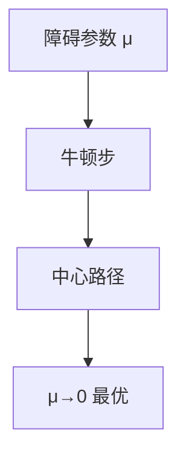

# 内点法直觉

不沿顶点走，而在可行域内部沿中心路径逼近最优；多项式次牛顿即可到给定精度。

<footer>—— 据 Karmarkar, A New Polynomial-Time Algorithm for Linear Programming, 1984；Nesterov and Nemirovski 内点理论整理</footer>

上一课[分支定界](/cs/branch-and-bound)为整数离开多面体内部。连续 LP 还有内点：障碍函数 $-\sum\log x_i$ 把边界推开，牛顿跟中心路径。缺口是这幅几何，不是 Karmarkar 原文的射影变换细节。不重写单纯形转轴。后课素数筛离开优化。

## 问题

单纯形最坏指数，平均快。椭球法多项式但慢。内点：最小化 $c^\top x-\mu\sum\log x_i$（对数障碍），$\mu\to 0$ 时趋向最优面。每步牛顿解 KKT 线性系统（正规方程），$\mu$ 按比例减小。多项式迭代，与输入位数和精度有关。

缺口是「内部路径」，不是再列顶点。

### 不是梯度下降课

约束是不等式，投影或障碍才保可行。无约束光滑优化的梯度/牛顿不自动处理 $Ax=b$。本课 LP 内点。

Karmarkar 1984。现代障碍/原始–对偶内点见 Nesterov–Nemirovski。实践中 LP 内点与单纯形竞争。后课筛法换数论对象。

## 方法

严格可行内点出发（或不可行内点变体）。短步或长步减小 $\mu$。解牛顿系统（稀疏 Cholesky）。终止：对偶间隙小。

二次锥、半定规划同源障碍，点名。

## 机制

自和谐障碍保证牛顿步二次收敛于中心。与单纯形：最坏多项式 vs 实用顶点。与对偶：原始–对偶内点同时更新 $x,y,s$。数值核心是线性系统，接上一课高斯的稀疏版。

不要对 ILP 直接内点当精确整数解——仍要舍入或分支。

## 边界

本课不证自和谐。不写全部 Mehrotra 预测校正。后课默认：LP 多项式可解（内点/椭球）；单纯形仍常用。下一课素数筛。

## 小结

- 对数障碍中心路径 + 牛顿。
- 连续 LP 多项式时间。
- 整数问题仍要舍入或分支。
- 出处：Karmarkar, 1984。
