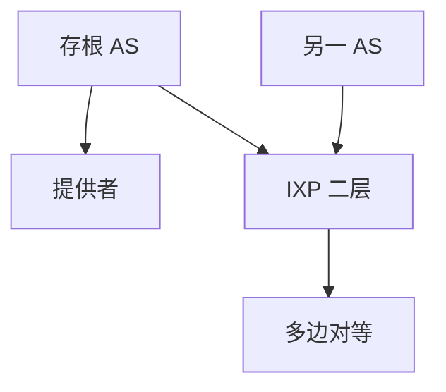

# 互联网拓扑与 IXP

AS 图不是随机图：客户–提供者层次加上 IXP 上的多边对等，让流量尽量在公共交换点「落地」而不绕供应商。

<footer>—— 据 Gao and Rexford, IEEE/ACM ToN 2001 政策稳定；RFC 7948 IXP 相关讨论；CAIDA AS 关系研究通识整理</footer>

[上一课](/cs/bgp-hijack-rpki) 护源。流量实际走哪张图？缺口是**拓扑**：层级、富俱乐部、IXP 交换机把许多 AS 接到同一二层。本课不把 MPLS TE 写完。

## 问题

若只有转供，小 AS 的流量爬到全球供应商再下来，贵且绕。IXP：共同交费连一台（或一组）交换机，双边/多边对等交换客户路由。这是「付费进房 + BGP」，不是免费全互联。拓扑测量：控制面看到的 AS_PATH 与数据面实际下一跳可能因热土豆不一致。RPKI 不画这张图，只验证源。

不要把 IXP 写成一个 AS：它通常不转供，只提供二层。

Gao–Rexford 条件保证某类政策下无永久振荡。route server 在 IXP 上减会话，像公共 RR。本课不点名具体交换点当广告。

### IXP 不转供

二层汇合加多方 BGP，不是一个 AS。对等无 SLA 也会拥塞。控制面路径与热土豆数据面可以分叉。

## 方法

画：层级供应商 + IXP 横边。对照校园以太网：IXP 也学 MAC，但上面跑很多 eBGP。LACP/MLAG 在 IXP 交换侧防单点，与校园同类。

方法止于选定对象与对照；机制才说它如何嵌入已有分层与主干课。

## 机制

流量工程后课会在这张图上挪入口。BGP 收敛事件在富连接图上扩散更快也更乱。卫星用户仍经关口 AS 进这张图。主干任播课：根 DNS 常出现在 IXP，是拓扑选择不是协议新字段。

route server：多边对等的控制面中心，数据面仍直连 IXP 交换机。

## 边界

本课不引入 peeringDB 的运维流程。流量工程是下一课。后课默认：互联网 = 政策图 + IXP 横连；不是 OSPF 一张度量图。

公开对等不等于承诺无拥塞：无 SLA 的对等口会满。

上一课留下的缺口在本课收口；「互联网拓扑与 IXP」进入后课词汇表后只引用。文献用来钉对象与边界，不把本课写成该主题的独立综述。下一课[流量工程](/cs/traffic-engineering)。

## 小结

- AS 关系决定默认路径；IXP 提供短的对等边。
- IXP 是二层汇合，不是转供 AS。
- 控制面路径与数据面可能因热土豆分叉。
- 后课只引用本课钉死的对象，不从该领域总问题重开。
- 出处：Gao–Rexford, 2001；IXP 运维通识。
