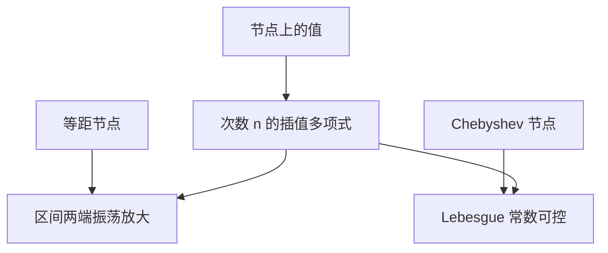

# 插值与龙格现象

在等距节点上提高多项式次数，并不保证在区间上更接近被插函数；龙格给出了振荡随次数变本加厉的例子。

<footer>—— 据 Trefethen and Bau, Numerical Linear Algebra；Higham, Accuracy and Stability of Numerical Algorithms 整理</footer>

上一课[非线性方程与牛顿](/cs/newton-nonlinear)把求根收成一系列线性系。本课不重讲 Jacobian，也不从逼近论的 Weierstrass 总定理另起。缺口是：多项式能穿过给定点，**穿过节点不等于区间上一致逼近；节点怎么排，本身就是这个映射的条件问题**。本课是数值计算最后一课；下一课改做硅上的[CMOS 反相器](/cs/cmos-inverter)。

## 问题

数据 $(x_i,y_i)$，$i=0,\ldots,n$，唯一次数 $\le n$ 的多项式 $p$ 满足 $p(x_i)=y_i$（节点互异）。这是线性问题：Vandermonde 系统，条件数随等距节点与 $n$ 迅速变坏——上一课的 $\kappa$ 在此现身。缺口因此不是「插值公式」，而是**插值算子作为 $f$：节点值映到区间上的函数，可以极病态**。龙格的 $1/(1+25x^2)$ 在 $[-1,1]$ 等距节点上，$n$ 增大时两端剧烈振荡。

Weierstrass 保证连续函数可被某列多项式一致逼近，但那一列不必是等距插值。把「次数更高更准」从泰勒或最小二乘误搬到等距插值，会与龙格直接冲突。换 Chebyshev 节点、换分段、换不经过点的最小二乘，是在换 $f$，不是把同一 Vandermonde 再多消一次元。

### 龙格不是「舍入造成的振荡」

即使精确算术，等距高次插值也可以在节点之间炸掉；这是问题病态，不是 $\gamma_n$ 没写好。舍入会再叠加——Vandermonde 求解本身就不稳定——但把龙格当成浮点 bug，会去调主元而继续加密等距点。正确动作是换节点族或放弃全局高次多项式。

Trefethen and Bau 用多项式插值连接线性代数与逼近。Higham 讨论 Vandermonde 的恶劣条件。本课不把复分析里的等势线证明写完，只取现象与对策。

## 方法

节点决定基的条件。Chebyshev 节点把极大范数下的 Lebesgue 常数压到对数增长，等距则可以指数坏。分段低次（样条）把问题拆成许多良态小插值。Newton 基比单项式基求值更稳，但不自动消灭龙格——节点仍在。求值用 Horner 时注意求和顺序与抵消。

最小二乘用更低次数去拟合更多点，映射的 $\kappa$ 通常好得多；它不再保证过点。牛顿求根若用插值模型代替 $f$，节点选择同样会把模型弄病态。

## 机制

等距点上的高次振荡，来自基函数为了过点必须在两端用很大的系数对消——又一次近量相消，发生在函数空间而不是两个标量之间。条件数大：节点值的微小扰动（含舍入）在端点附近被放大成巨幅摆动。换节点是在换 $f$ 的采样，使该映射的 $\kappa$ 下降。数值课到此收束：舍入、条件、稳定、消去、线性与根、插值，都不再碰 IEEE 位型本身。下一课用 CMOS 把比特的物理判决做出来，组成课程开始。

Lebesgue 常数是插值算子的 $\kappa$ 在极大范数下的面孔：它给出节点值扰动被放大到区间上的倍数。等距节点上它随 $n$ 指数变坏，Chebyshev 上只对数变坏——同一套「条件数属于问题」的语言。分段样条把 $n$ 换成许多个小的局部 $n$，每段 $\kappa$ 可控，代价是整体光滑性要靠连接条件。数值课到此可以交给组成：舍入与条件已经够用来读后课电路里的噪声容限——那是另一类「扰动放大」，对象从矩阵换成电压，但「先问问题敏不敏感」的习惯应当带走。下一课不再做多项式，而做 CMOS 反相器。

## 边界

本课不讲有理插值与径向基的全部理论。大模型栏的插值与连续嵌入是另一套对象，本栏不写 Transformer。金融栏的样条定价不进来。后课默认：等距高次插值可以病态；龙格是问题而非纯舍入；组成课从[CMOS 反相器](/cs/cmos-inverter)起，不再继续数值分析。

## 小结

- 过节点的多项式唯一，但不保证区间上逼近改善。
- 龙格：等距高次在精确算术下即可振荡；Vandermonde 还叠加恶劣 $\kappa$。
- 换 Chebyshev 节点或分段低次，是在换更良态的 $f$。
- 数值计算课结束；下一课是 CMOS 反相器。
- 出处：Trefethen and Bau；Higham。
