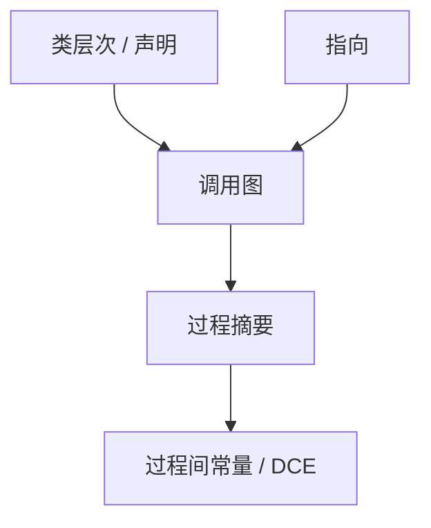

# 过程间分析与调用图

过程内分析在调用处停下。调用图给出谁调用谁；过程间分析沿边传摘要或内联式克隆。间接调用靠指向分析补边。

<footer>—— 据 Callahan, Cooper 等过程间分析；Grove and Chambers 调用图；龙书 12 章整理</footer>

上一课[指向分析](/cs/points-to-analysis)在过程内给 `*p`。缺口是**跨函数**：`foo` 写不清全局，`bar` 的 load 就不能 LICM。调用图（CG）：节点函数，边调用点。间接：函数指针、虚调用。本课钉 CHA/指向建图与摘要，不写完整内联启发——下一课。

## 问题

无 CG 则每个调用当「什么都写」。精确 CG 依赖指向，指向依赖 CG，迭代。CHA（类层次）：虚调用接到所有覆写，保守。缺口是**图 + 摘要**（mod/ref 集合），不是 Andersen 约束细节。

上下文敏感：同一函数因调用点不同有不同摘要，减污染，占内存。

### 调用图不是 CFG

CFG 是过程内块；CG 是过程间。不要把 `call` 指令的 CFG 后继当 CG 的唯一定义——间接边会变。

Grove–Chambers。Horwitz–Reps–Binkley 系统依赖图点名。龙书过程间。本课不写完整 IFDS/IDE 算法。

## 方法

先 CHA 或声明分析建粗图。跑指向，加边，直到稳。每函数算 mod/ref、纯否、不抛否。优化查询：调用是否写某对象。

与 SCCP：IPSCCP 沿 CG 传常量。与 LTO：全程序 CG 更全，后课。

## 机制

递归与 SCC：摘要要在强连通分量上迭代。动态加载（`dlopen`）使 CG 开世界，须保守。不要把 JIT 的运行时 CG 当 AOT 的同一对象，运行时单元再谈。

## 边界

本课不写内联预算。后课默认：优化可问「callee 写什么」。下一课内联启发：用 CG 与体大小决定复制。

也不把微服务 RPC 当调用图。

## 小结

- 调用图 + 摘要 = 过程间分析的骨架。
- 间接调用与指向联立迭代。
- 开世界（动态加载）强制保守。
- 出处：Callahan/Cooper；Grove and Chambers；龙书第 12 章。
