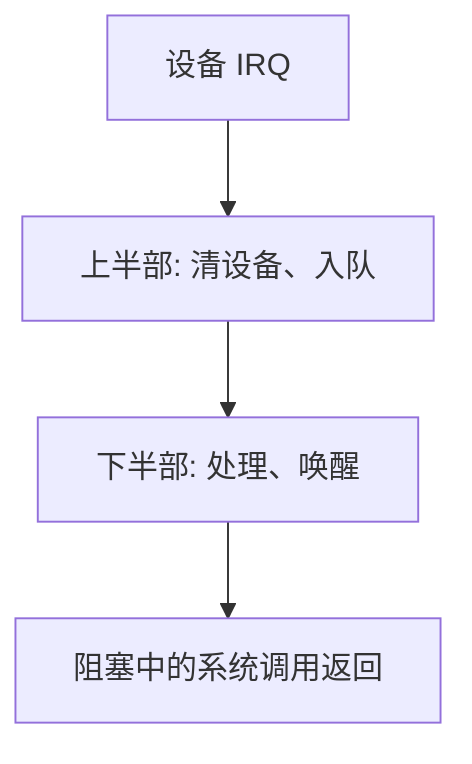

# 中断下半部

中断处理应尽可能短：记下设备状态，把费时工作留到中断已重新开启之后。

<footer>—— 据 Bovet and Cesati, Understanding the Linux Kernel；Silberschatz et al. 对中断处理的整理</footer>

[上一课](/cs/syscall-trace)让用户同步地请内核办事。设备却在 CPU 不知情时完成 DMA、网卡收包。[异常与中断入口](/cs/exception-interrupt-entry)已经能跳进处理程序。缺口是：若在关中断的上半部里做完协议解析与进程唤醒，延迟与死锁风险都不可接受。本课把工作拆成**上半部与下半部**。

## 问题

上半部（ISR）发生时，可能关中断或关该 IRQ 线，不能睡眠，不能做无界循环。网卡却可能一次送来整页数据，需要分配、校验、交给等待 `read` 的线程。缺口不是新的陷入硬件，而是承认：入口只做**不可延迟**的最小动作（读状态、清设备、排队），其余放到可调度、可开中断的下半部。

本课不把 Linux `softirq`/`tasklet`/`workqueue` 的历史逐一对照，只保留「短上半、可推迟下半」这条纪律。

下半部仍在内核态，只是不再占用 IRQ 上下文。它可以唤醒阻塞在系统调用路径上的线程，于是用户 `read` 才返回。

## 方法

设备中断 → 上半部：应答硬件、把缓冲区描述符或状态填进队列、标记「有下半部待跑」→ 尽快返回。之后在内核可抢占点或软中断点跑下半部：处理队列、调用协议、`wakeup`。若下半部仍太重，再丢给工作线程，完全像普通内核线程那样可睡眠。

与系统调用路径的会合点是等待队列：调用在路径里睡眠，下半部唤醒。本课不写具体队列 API。

## 机制

拆分让中断延迟有上界：其他设备不会被一次长时间 ISR 饿死。上半部与下半部之间的队列是共享数据，后课的锁必须分清「能否在 IRQ 上下文拿」。本课只预告这个约束，不引入自旋锁。

DMA 完成中断是典型上半部来源；字节如何从设备进内存，是本课程更后的 [I/O 与 DMA](/cs/io-dma)。这里只要求：完成通知走中断，重活不走 ISR。

## 边界

本课不讲解线程化中断的全部实现，不把信号当成下半部——信号是用户态异步通知，更后一课。也不把「下半部」说成必须延迟例程这一种名字；教材与 Linux 用词不同，对象相同。

NMI 与机器检查几乎不能推迟，不属于普通下半部；主干只谈可屏蔽设备中断。

后课默认：设备完成先入上半部，再在下半部会合到阻塞的系统调用。CPU 上有多条可运行线程时如何选，下一课先问调度指标。

## 小结

- 上半部短、不可睡；下半部可推迟、可唤醒系统调用。
- 与用户路径通过等待队列会合。
- 锁与 IRQ 的搭配是后课；DMA 细节更后。
- 出处：Bovet and Cesati；Silberschatz et al., *OSC*；Tanenbaum and Bos, *MOS*。
