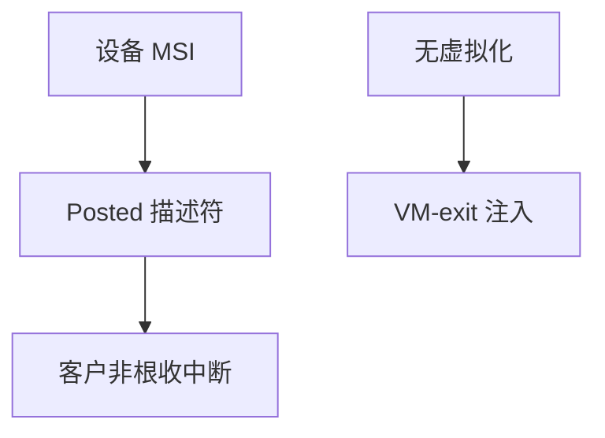

# posted interrupt

Posted interrupt 让宿主把客户中断描述直接写进内存描述符，CPU 在客户模式接受中断而不必每次 VM-exit 到 VMM 注入。

<footer>—— 据 Intel 对 APICv/Posted Interrupt 的说明；KVM 中断虚拟化文档；[VM-exit](/cs/vmx-vmexit) 为代价先修</footer>

[VFIO](/cs/vfio) 直通后 IRQ 仍可能打宿主。[NAPI](/cs/napi) 在客户里。缺口是 **中断虚拟化**：APIC 虚拟化与 posted。

## 问题

传统：物理 IRQ → 宿主 → exit 注入客户。posted：硬件把中断记到 PID 描述符，客户 `sti` 时递送。缺口：vhost 与 irqfd 已减用户退出；posted 再减内核退出。本课不把 APIC 寄存器图抄完。

ARM GICv4 有类似 LPI 直投。对象是少 exit，不是实时保证。

## 方法

启用 APICv → 设备 MSI 指向 posted → 客户在非根模式收中断。对照 [半虚拟](/cs/paravirtualization) virtio 中断：仍可走 eventfd。对照 [PREEMPT_RT](/cs/preempt-rt)：宿主 RT 与客户中断是两层。

## 机制

中断虚拟化把「设备吵」从 VMM 热路径拿掉，使直通和 virtio 都能接近裸机 IRQ。不要写成 PIC 历史课。与 [RSS](/cs/rss-multiqueue)：客户内多队列仍要自己绑。

无硬件支持则退回 exit 注入。

实现上：irqfd 把事件 fd 接到注入路径，已比 ioctl 注入快。posted 再进一步让客户在非根模式收。无 APICv 时每个虚拟中断都可能 exit。 读法上只引用[上一课](/cs/vfio)的结论，不把对象换成训练推理或限价簿。

本课在操作系统进阶的「虚拟化与隔离进阶 / Hypervisor」课序里，对象是 **posted interrupt**。

- 先修只引用，不重导：上一课的结论当公理，本课只补差。
- 五栏不吞并：不把本课写成大模型训练/推理，也不写成限价簿或权重量化。
- 文献用 OSTEP、McKusick、内核文档与具名会议论文；不发明 arXiv 编号。

## 边界

本课不引入所有 EOI 虚拟化细节。不保证旧 CPU。下一课时钟：客户看见的计时器。

版本字段会变，课序钉的是机制对象「posted interrupt」，不是某一主线内核的结构体名。
后课默认：客户中断可被 posted 减少 exit。时钟与 TSC 虚拟化，下一课。

## 小结

- posted/APICv 让客户在非根模式收中断。
- 目标是砍掉中断引起的 VM-exit。
- 时钟虚拟化是下一课。
- 出处：Intel SDM APIC virtualization；KVM。
