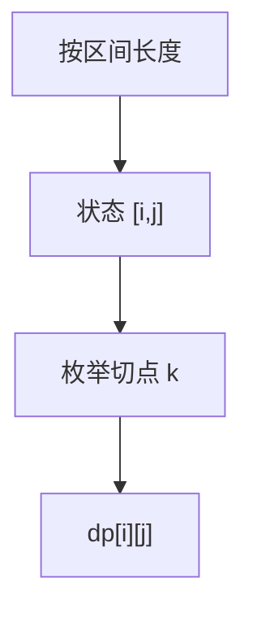

# 区间 DP 直觉

最优在区间内部某点切开；按长度从小到大填表，$O(n)$ 个左端、$O(n)$ 个右端、$O(n)$ 个切点，常是 $\Theta(n^3)$。

<footer>—— 据 Godbole, On the Computation of Matrix Chain Products, 1973；CLRS 第 15.2 节整理</footer>

上一课[背包](/cs/knapsack)把状态做成「前 $i$ 件 × 容量 $w$」，$\Theta(nW)$ 随 $W$ 的数值膨胀，还没有复杂度类的名字。本课不重写 0-1 转移。缺口是另一族状态：**子数组或子链的闭区间** $[i,j]$，转移枚举切点 $k\in(i,j)$。矩阵链乘法、石子合并、最优二叉搜索树都是这张表。输入长度是 $n$ 个元素，$\Theta(n^3)$ 相对 $n$ 是多项式；背包那张表相对二进制输入仍可能指数——下一课才把两类分开命名。

## 问题

$n$ 个矩阵相乘 $A_1\cdots A_n$，结合律使切点不同代价不同（维数 $p_{i-1}\times p_i$）。$dp[i][j]$ 为乘完 $A_i\cdots A_j$ 的最小代价，转移 $dp[i][j]=\min_k(dp[i][k]+dp[k+1][j]+p_{i-1}p_k p_j)$。必须先算短区间：长度 $1$ 代价 $0$，再长度 $2,3,\ldots$。缺口是「切点在区间内部」，不是再发明容量。

石子合并（相邻两堆合并）同一骨架，代价定义不同。括号化与最优 BST 也是区间加切点。不要把最长公共子序列硬塞进区间：LCS 的状态是两个前缀，不是一段连续下标的切。

### 区间不是滑动窗口贪心

贪心「每次合并最便宜的相邻对」一般错，没有交换论证。必须枚举切点。这正是[最优子结构](/cs/opt-substructure)成立、贪心选择不成立的例子。

CLRS 15.2 矩阵链。Godbole 1973 讨论链乘计算。本课要填表顺序与 $\Theta(n^3)$，不把 Knuth 优化（四边形不等式把切点单调、降到 $n^2$）写进主干。

## 方法

定义 $dp[i][j]$。边界：空段或单元素。按 $j-i$ 升序，对每个 $k$ 取 $\min$ 或 $\max$。方案记录 $\mathrm{arg}$。复杂度：状态 $O(n^2)$，转移 $O(n)$。

与背包对照：这里没有 $W$ 这一维；多项式性对 $n$ 成立。背包判定仍可能难，因为 $W$ 的位数才是输入长度。

## 机制

最优子结构：最优括号在唯一顶层切点 $k^*$ 切开，左右链必须最优。重叠：许多 $[i,j]$ 共享更短区间。环上的区间（首尾相邻）要加倍或断环成链，本课点名，不写完环形石子。

不要对有交叉而不只切一刀的结构用二维区间（真的平面剖分是卡特兰，状态更肥）。

## 边界

本课不命名 P/NP，不证矩阵链在 P。不引入四边形不等式加速。后课默认：连续区间上的最优结合用 $\Theta(n^3)$ 区间 DP；背包式 $\Theta(nW)$ 仍按数值计。判定问题的多项式时间从下一课起才叫 P。

## 小结

- 区间 DP：状态是 $[i,j]$，转移切一刀，常 $\Theta(n^3)$。
- 对 $n$ 多项式；背包 $\Theta(nW)$ 仍随数值涨。
- 相邻合并的贪心一般没有交换论证。
- 出处：CLRS 第 15.2 节；Godbole, 1973。
