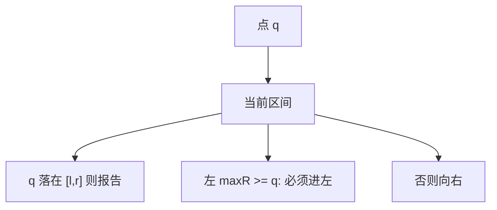

# 区间树

按区间中点（或左端）建 BST，节点记下子树右端最大值；stabbing 一条查询线时，用最大值剪枝。

<footer>—— 据 Preparata and Shamos, Computational Geometry；Cormen, Leiserson, Rivest and Stein 第 14.3 节；de Berg et al. 整理</footer>

[上一课](/cs/y-fast-trie) 回答整数点的前驱后继。现在对象是闭区间 $[l,r]$，询问「哪些区间包含点 $q$」或「与 $[a,b]$ 相交」。本课不把 vEB 当几何。缺口是区间树（interval tree）：与线段树同名易混，这里是**一组区间对象**的字典，不是下标对半。

## 问题

$n$ 个区间，点查询 $q$。暴力 $\Theta(n)$。区间树：以左端（或中点）为 BST 键；每个节点额外存**该子树所有区间的最大右端**。查询：若 $q$ 在当前区间内则报告；若左子树 $\mathrm{maxR}\ge q$ 则必须进左，否则只进右（因为左端有序，左边左端更小，若最大右端仍 $\lt q$ 则左边全错过 $q$）。缺口是**用 maxR 把 BST 查找变成 stabbing**。

CLRS 14.3 用红黑存区间并维护 max。几何书里还有 segment tree（下标/扫描线另一套），名称不要混用本课课名。

## 方法

插入删除：BST + 沿路径更新 maxR，平衡与[顺序统计](/cs/order-statistic-tree) 维护 size 同模式。报告所有命中最坏 $\Theta(n)$（全中）；时间 $O(\log n+k)$。只问是否存在相交，可提前停。

与 Fenwick/线段树：那些是数组下标上的聚合；本课每个元素自己是一段 $[l,r]$。一维 stabbing 不要用 k-d 树。

## 机制

正确性依赖左端子树键 $\le$ 当前 $\le$ 右，以及 maxR 真实。旋转必须修 maxR。坐标若很大可离散化，结构不依赖 vEB。

重叠极大时 $k$ 大，输出瓶颈，结构帮不上。

## 边界

本课不写区间树套动态树、或三维。正交矩形范围查询下一课 k-d 树与后课 R 树。点集矩形查询与区间 stabbing 选错结构会多一个 $\log$。

后课默认：一维区间包含用区间树。平面点的正交范围用 k-d 树。

## 小结

- 区间树：BST（左端）+ 子树 maxR，stabbing $O(\log n+k)$。
- 与下标线段树不是同一结构。
- 平面点范围查询交给 k-d 树。
- 出处：Preparata and Shamos；Cormen et al. 14.3。
