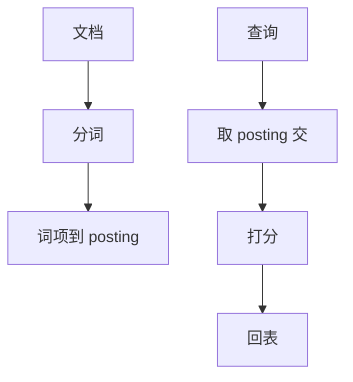

# 倒排与全文

倒排表从词项指向出现位置；全文检索是查询该表，不是 `LIKE '%x%'` 扫堆。

<footer>—— 据 Manning, Raghavan and Schütze, Introduction to IR； Zobel and Moffat 倒排索引；数据库 GIN/全文实践</footer>

[上一课](/cs/bitmap-index)用值→行位图。本课不 AND 维值。缺口是文本：词项多、文档长、要短语与排名。倒排索引（inverted index）：词典 + 每个词的 posting（文档 id、词频、位置）。关系库用 GIN/GiST 或外置搜索引擎；本课机制，产品课在后课搜索引擎。

## 问题

`LIKE '%foo%'` 不能用 B+ 前缀。全文：分词、停用词、词干，再查 posting 交。短语：位置相邻。缺口是**把文档当分析对象**，行是文档或文档碎片。更新：文档改则要改多个 posting，写放大类似位图但 NDV（词表）极大，常用 LSM 或段+不可变（Lucene 谱系）。

排名（TF-IDF、BM25）在 posting 上算，不是 SQL `ORDER BY length`。与向量检索后课不同：这里是稀疏词空间，不是稠密嵌入。

Manning et al. IR 教材。Zobel and Moffat 倒排综述。PostgreSQL tsvector/GIN、InnoDB 全文是库内子集。本课不教语言学。

## 方法

建索引：分词 → 写 posting，压缩差量文档 id。查询：解析查询串 → 取 posting → 交/并/位置过滤 → 打分截断。与 SQL：谓词 `@@` 下推成倒排扫描，再回表取行。

事务：库内全文要进同一事务，恢复与 WAL 对齐；外置引擎常最终一致，CDC 后课。

## 机制

段：不可变倒排段，查询时多段堆归并，后台合并——LSM 思想在搜索里。zone/跳过：对文档 id 范围可跳过。延迟物化：先 id 再取标题列。

与位图：低 NDV 可用位图当 posting；词项 posting 通常是压缩整数列。

## 边界

本课不讲 R 树。也不把向量 ANN 当全文。通配与正则另有三gram 倒排变体，点名。

后课默认：全文走倒排，不要前导百分号 LIKE。空间索引：几何对象的选择率与邻接，结构换成 R 树等。

倒排回答「哪些文档含这些词」；关系谓词仍在回表后做。

## 小结

- 倒排是词项→位置列表；全文查询是交并与打分。
- 更新走段合并或 LSM，与行锁粒度不同。
- 空间索引下一课：几何过滤用另一族树。
- 出处：Manning et al.；Zobel and Moffat；库内 GIN 实践。
