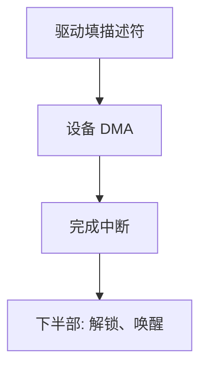

# I/O 与 DMA

DMA 让设备在 CPU 不逐字节介入的情况下把块搬进内存；完成时用中断汇报。

<footer>—— 据 Tanenbaum and Bos, Modern Operating Systems；Patterson and Hennessy 对 DMA 的整理</footer>

[上一课](/cs/bio-block)把 `readpage` 派到某文件系统。[缓冲与脏页](/cs/buffer-dirty)需要帧里出现磁盘字节。[中断下半部](/cs/interrupt-bottom-half)已假定「设备会完成」。缺口是搬动本身：CPU 端口 I/O 一次一字节太贵；**DMA** 让控制器成为总线主设备。本课不引入网卡帧格式。

## 问题

可编程 I/O（PIO）：CPU 循环读端口，写入内存，期间不能干别的，吞吐被 CPU 速度绑死。中断驱动 I/O 仍可能每字符一中断。块设备与网卡需要突发：CPU 只写描述符（地址、长度），设备把数据写入物理帧，然后 IRQ。缺口不是 VFS 操作表，而是这条数据通路，以及「设备看见的是物理地址」与[分页](/cs/paging-vm)的接头（IOMMU 或页锁）。

本课不写 PCIe 事务层。

DMA 地址必须是设备可达的物理（或 IOVA）连续描述。页 Cache 中的帧要钉住，直到传输结束，否则置换会抽走正在 DMA 的页。

## 方法

驱动：把缓冲钉在内存，填 DMA 描述符，敲门铃寄存器。设备传输。IRQ → 上半部清状态 → 下半部解锁页、标记 Cache 最新、唤醒 `read`。CPU 全程不拷用户可见的那一大块（内核到用户仍可能 `copy_to_user`，mmap 则可免）。

## 机制

DMA 把 I/O 从「占用 CPU 的循环」变成「占用总线与中断配额」。调度因此能在等待磁盘时跑别的线程——这是整门 OS 课从进程到文件的闭合：阻塞是因为 DMA 还没完。一致性：若 Cache 与 DMA 同时看见同一行，架构要嗅探或显式写回；教学承认有一致性协议，不把总线时序写完。

与网络课的接头：网卡同样 DMA 帧到内存；但两台机器之间还没有「帧」这个名字。那是下一课分层的起点。

## 边界

本课不引入 RDMA 的全部动词，不把轮询驱动（DPDK）当默认。也不把 DMA 写成攻击面分析。内存映射寄存器（MMIO）仍是 CPU 访存，与 DMA 互补：控制走 MMIO，大块数据走 DMA。

分散—聚集 DMA 让缓冲不必物理连续，描述符链指向多个帧。IOMMU 给设备一张自己的虚地址，限制它能写的物理范围。

未对齐或非 DMA 可达的缓冲要先拷到 bounce buffer，这是隐藏的 CPU 拷贝。

后课默认：一台机器可以把设备字节搬进帧。两台机器如何共享对「一帧」的命名与责任划分，下一课分层与端到端。

## 小结

- PIO 绑 CPU；DMA 让设备写物理缓冲，中断收尾。
- 页必须钉住；完成走已有的下半部路径。
- 跨机器的帧与协议分层是网络课的第一缺口。
- 出处：Tanenbaum and Bos, *MOS*；Patterson and Hennessy, *COD*；Silberschatz et al., *OSC*。
