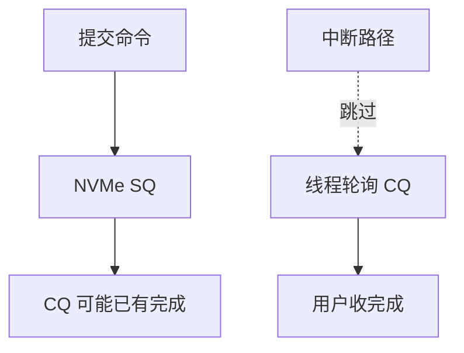

# 轮询 I/O

当完成已在微秒级，进中断再调度的税可能大于等一轮门铃；轮询让提交线程自己收 CQ。

<footer>—— 据 Linux blk-mq poll / io_uring IOPOLL 文档；NVMe 规范对完成队列的说明</footer>

[上一课](/cs/dax-pmem)甚至没有完成队列。[NVMe](/cs/nvme-driver) 默认 MSI-X：延迟 = 设备 + 中断 + 软中断 + 唤醒。[POSIX AIO](/cs/posix-aio) 没解决这条。缺口是 **轮询 I/O**：谁在转、何时混合中断。

## 问题

高 IOPS 时中断风暴。`nvme poll` 或 io_uring `IORING_SETUP_IOPOLL`：提交后在 CQ 上转，直到完成或让出。缺口：要独占 CPU；低负载浪费能源；与 [blk 调度](/cs/blk-schedulers) 的 none 常一起用；缓冲 I/O 难以 poll（完成路径在缓存）。本课对象是块层/uring 轮询，不是网卡 NAPI——NAPI 在网络课。

hipri 轮询队列、混合模式（超时才中断）是工程旋钮。教学上：完成通知从 IRQ 换成 busy-wait。

## 方法

应用提交 uring SQE（DIRECT 文件或 nvme），内核把命令进 SQ，线程在 `io_cqring` 或驱动 `poll` 钩上转。对照中断路径：无 `irq_handler`、少一次调度。对照 DAX：根本无 CQ。对照 SCSI：HBA 是否支持轮询因卡而异。

## 机制

轮询把尾延迟的软件部分压下去，用 CPU 换 IRQ。这是存储栈与后课网络旁路的共同主题。不要写成实时 FIFO 保证：轮询线程仍可能被抢占，除非隔核与 PREEMPT_RT 后课。能源：空转 C-state 进不去，[cpuidle](/cs/cpuidle-cstate) 会再出现。

安全：用户轮询不授予绕过权限检查；只是完成路径。

实现上：hipri 轮询需要队列支持，且通常要求 O_DIRECT。线程被调度跑开则轮询变成「忙等别人的完成」，要绑核。混合模式在超时后降回中断，避免空转。 读法上只引用[上一课](/cs/dax-pmem)的结论，不把对象换成训练推理或限价簿。

本课在操作系统进阶的「存储栈 / 块层到设备」课序里，对象是 **轮询 I/O**。

- 先修只引用，不重导：上一课的结论当公理，本课只补差。
- 五栏不吞并：不把本课写成大模型训练/推理，也不写成限价簿或权重量化。
- 文献用 OSTEP、McKusick、内核文档与具名会议论文；不发明 arXiv 编号。

## 边界

本课不把 io_uring 全部 opcode 写成手册。不保证虚拟机里轮询有效（要半虚拟 poll 队列）。下一课用 cgroup 限制这块带宽：blkio。

版本字段会变，课序钉的是机制对象「轮询 I/O」，不是某一主线内核的结构体名。
后课默认：完成可以靠轮询收取。按组限制 IOPS/带宽，下一课 blkio cgroup。

## 小结

- 轮询用 CPU 收 CQ，去掉中断唤醒。
- 适合 DIRECT 高 IOPS；低负载不合适。
- blkio 限制是下一课。
- 出处：Linux io_uring IOPOLL；NVMe；blk-mq poll。
