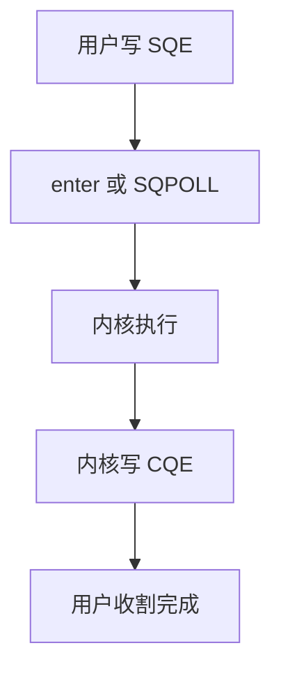

# io_uring

用户与内核共享提交队列和完成队列：一次陷入可提交多条 I/O，完成不必为每个请求再进系统调用。

<footer>—— 据 Axboe, Efficient IO with io_uring, 2019；Linux io_uring 文档整理</footer>

[上一课](/cs/epoll) 仍是「就绪再 read」，每次读写一条系统调用。[blk-mq](/cs/blk-mq) 已能并行提交块请求。缺口是把提交与完成做成**环形缓冲**：程序把 SQE 写进共享页，内核写 CQE。本课讲机制与和 epoll 的分工，不发明 arXiv 编号。

## 问题

高 IOPS 时，陷入与 `copy_from_user` 成为主成本。aio 接口历史上限制多、完成模型别扭。io_uring：mmap 两圈队列，可选 `IORING_SETUP_SQPOLL` 用内核线程轮询提交（权衡 CPU）。缺口不是重做 bio，而是用户可见的队列与一次 `io_uring_enter` 的批处理。文件、套接字、稍后的超时都可成为 op。

固定文件与固定缓冲减少每次把 fd/地址翻译进内核的开销。完成顺序不必等于提交顺序。本课不写利用错误注册缓冲的步骤。

## 方法

`io_uring_setup` 得到 fd 与映射地址。用户填 SQE（操作码、fd、缓冲、偏移）。内核取出执行，结果进 CQE（结果码、用户 data）。程序可以 epoll 这个 uring fd，或再 enter 等待完成。块设备路径最终仍可走 bio；本课不重画 DMA。

## 机制

io_uring 把系统调用路径从「每请求一次」改成「每批一次」，并让完成与提交解耦，便于流水线。它不取消 [VFS](/cs/vfs) 与权限检查：每个 op 仍以发出进程的身份执行。与共享内存 IPC 不同：这里共享的是请求描述，不是业务文件内容本身（除非 op 指向共享缓冲）。

## 边界

本课不把所有 opcode 列成表。不保证旧内核有 uring。下一课离开事件 I/O，进入内核如何数时间：滴答与 jiffies——超时与调度一直在用，尚未当课。

后课默认：I/O 可批量异步完成。内核的滴答计数与 HZ，下一课 jiffies。

## 小结

- io_uring 用共享 SQ/CQ 批量提交与收割 I/O。
- 仍走 VFS 权限；底层可接 bio。
- 内核时间基准是 jiffies 的缺口。
- 出处：Axboe, *Efficient IO with io_uring*（2019）；Linux `io_uring` 文档。
