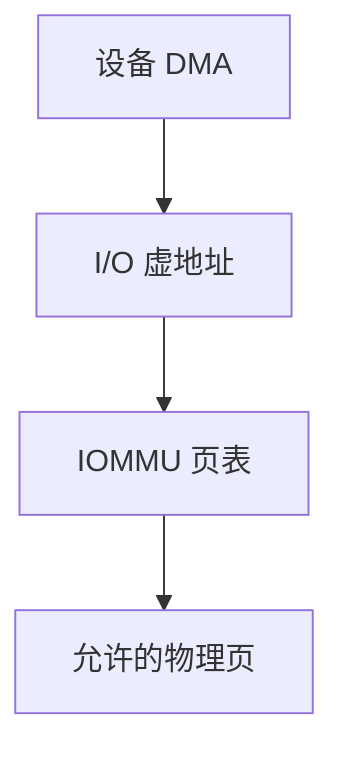

# IOMMU

IOMMU 给设备一张自己的页表：DMA 使用 I/O 虚地址，内核限制设备能写到哪些物理页。

<footer>—— 据 AMD/Intel IOMMU 架构概述；Tanenbaum 对 DMA 保护的整理</footer>

[上一课](/cs/io-dma)让设备按物理地址写帧，并点到 IOMMU。[分页](/cs/paging-vm) 保护的是 CPU 路径；设备作为总线主设备不走用户页表。缺口是**设备翻译与隔离**：错误的描述符或恶意设备不应写任意 DRAM。本课讲机制，不写攻击步骤。

## 问题

无 IOMMU：DMA 地址 = 物理地址（或 bounce）。外设或驱动 bug 可以覆写内核。有 IOMMU：驱动为一次传输建立 IOVA→PA 映射，设备只看见 IOVA。传输结束解映射。缺口不是重导 CPU 页表格式，而是：另一套翻译对象，权限更粗，与 [TLB](/cs/tlb-translate) 类似也有 IOTLB，失效要 shootdown 设备侧缓冲。

本课不把 VT-d 与 AMD-Vi 的寄存器级编程当考纲。

VFIO/设备直通把 IOMMU 分组借给客机，虚拟化课会再提。这里只要求：CPU 分页管 CPU，IOMMU 管设备。

## 方法

驱动：dma_map 把 bio 的页做成 IOVA，填入设备描述符。IOMMU 硬件按设备源 ID 选上下文表，走 I/O 页表。非法 IOVA 可中止并中断。完成：dma_unmap，IOTLB 作废。与 buddy 钉页规则同时成立：映射期间页不得被置换。

## 机制

IOMMU 把 DMA 从「信任设备」改成「设备也有地址空间」。这与用户/内核分裂平行：都是翻译上的权限，主体不同。性能代价是映射建立与 IOTLB 缺失。不要在此写如何绕过 IOMMU。

块层 bio 仍描述页；IOMMU 是 DMA API 之下的翻译。

## 边界

本课不引入 ATS/PRI 等 PCIe 扩展全文。不保证所有平台有 IOMMU 或已开启。下一课离开块与 DMA，进入进程间的异步通知：信号。

后课默认：设备 DMA 可被限制在映射过的页。针对进程的软件中断，下一课信号。

## 小结

- IOMMU 为 DMA 提供 IOVA 翻译与设备隔离。
- 映射期必须钉页；IOTLB 要作废。
- 进程级异步事件是信号课的缺口。
- 出处：Intel VT-d / AMD-Vi 概述；Tanenbaum *MOS*；Linux DMA API。
