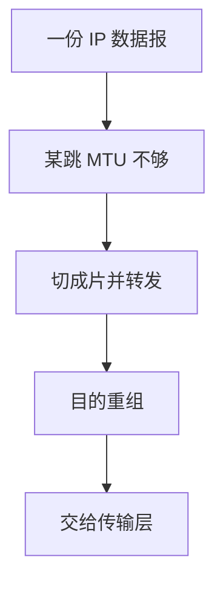

# IP 分片

路径上各链路 MTU 不同；IPv4 允许路由器把数据报切成片，目的主机用标识与片偏移拼回。

<footer>—— 据 Postel, RFC 791；Kurose and Ross 对分片与重组的整理</footer>

[上一课](/cs/lpm)按最长前缀选出下一跳。本课不重做 TCAM 直觉。缺口是：下一跳链路能装的载荷（MTU）可能小于这份数据报。RFC 791 允许中间节点分片；重组只在最终目的。本课不把 ICMP 的「需要分片」当已讲完。

## 问题

以太网载荷常 1500 字节，中间某跳更小（隧道、PPPoE）。若路由器只丢，端到端必须自己发现。IPv4：片头复制大部分 IP 头，用 Identification 标明同属一份，Flags 与 Fragment Offset 标明位置与是否最后一片。任一片丢则整份失败。缺口是**把一份数据报适配多段 MTU**，不是新的路由算法。

DF 置位则不分片，发 ICMP 要求缩小。PMTU 发现把分片从路由器推回源主机。IPv6 禁止中间分片，对照在后课。

## 方法

超 MTU 且允许分片：切开载荷，每片独立转发、独立 LPM。目的用标识+源+目的+协议把片放进重组缓冲，到齐或超时。片乱序到达是正常的；重叠片是异常，实现必须定义如何拒收，本课不把重叠当攻击教程。

## 机制

分片让网络层在异构链路上仍交出「主机到主机」的数据报语义，代价是放大丢包：丢一片等于丢全部。校验：IPv4 头校验每片重算；载荷校验在传输层，重组后才有意义——又一次[端到端](/cs/layering-e2e)。防火墙与 NAT 必须跟踪片或要求第一片带端口，否则后课 NAPT 会卡住。

## 边界

本课不引入全部 IPv6 分片头字段，不把巨型帧当默认 MTU。也不讨论应用层自己切 UDP 载荷与 IP 分片的重复。ICMP 如何回报不可达与超时，下一课。

后课默认：IPv4 可以在路上切开，只在目的拼回。控制报文与错误回报，下一课 ICMP。

## 小结

- RFC 791：中间可分片，目的重组；一片丢失则整份失败。
- DF 把问题推回源站。
- 错误与探测用 ICMP，下一课。
- 出处：RFC 791；Kurose and Ross。
