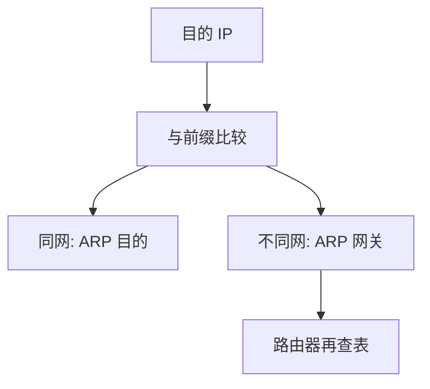

# IP 编址与子网

互联网数据报带上源与目的的全球地址；子网用掩码把地址切成「网络 + 主机」，同一网络内才直接 ARP。

<footer>—— 据 Postel, RFC 791, Internet Protocol, 1981；Cerf and Kahn, 1974 整理</footer>

[上一课](/cs/arp-cache)能在一跳上解析地址，但还没有说哪些 IP 算「一跳之内」。[分层](/cs/layering-e2e)要主机到主机的网络层。缺口是 **IPv4 编址与子网**：32 位地址、掩码、同一子网直连，跨子网交给路由器。本课不把最长前缀匹配的查找结构写完。

## 问题

若全球扁平 MAC 当唯一名字，路由表无法聚合，以太网也不能跨任意拓扑。Cerf 与 Kahn 把分组加上网络层地址，经异构网络转发。RFC 791：版本、头长度、TTL、协议号、源/目的地址。分类地址（A/B/C）浪费空间，子网与后来的 CIDR 用前缀长度 $n$ 表示「前 $n$ 位是网络」。缺口是这套编号，不是 BGP。

本课不把 NAT 提前；地址不够是更后的课。

主机：目的与自己同掩码则 ARP 目的；否则 ARP 默认网关。路由器：每接口一块子网。TTL 每跳减一，防环。

## 方法

接口配置地址与前缀。转发：若目的在直连前缀，解析该网 MAC；否则查路由表下一跳再 ARP 下一跳。分片：MTU 不够可切（后课 IPv6 对照会收紧）。校验和只盖 IP 头。载荷交给协议号指定的传输层——UDP/TCP 还没讲。

## 机制

IP 让[生成树](/cs/spanning-tree)只管一个广播域：不同子网可以、也应该分开广播域。端到端：IP 是尽力而为，丢包、乱序、重复都允许；可靠性留给传输层，符合 Saltzer 论证。进程仍看不见 IP 头，除非原始套接字；普通应用等到传输层。

与文件抽象的差别：IP 包是数据报，不是 inode 上的流。流是 TCP 的缺口。

## 边界

本课不把移动 IP 与任意播当主干。不引入 IPv4 选项的源路由（安全问题留给安全课）。转发时如何在多条前缀里选最具体的一条，下一课最长前缀匹配。

广播地址与网络地址本身通常不分配给主机。CIDR 下「全零/全一」的旧分类禁忌部分放宽，配置仍要避开本网广播。

后课默认：主机用掩码决定直邻；跨网走路由器。路由表查找键是前缀，下一课 LPM。

## 小结

- IPv4 数据报按 32 位地址尽力转发（RFC 791）。
- 子网掩码划分直连范围；跨网 ARP 网关。
- 多前缀如何选中，是 LPM 的缺口。
- 出处：RFC 791；Cerf and Kahn, *IEEE Trans. Comm.* 1974；Kurose and Ross。
