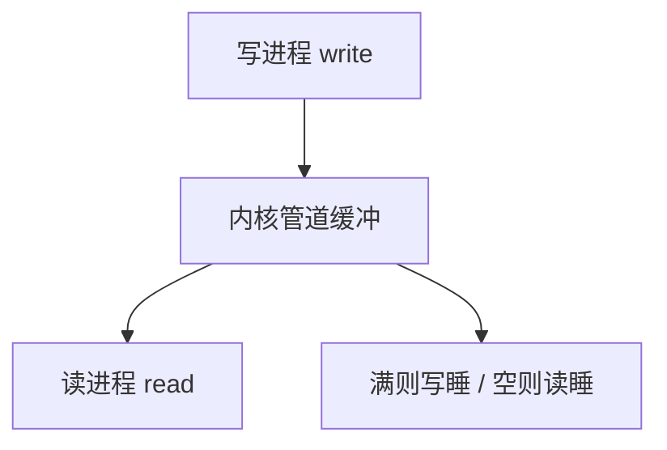

# 管道与 IPC

管道是两个进程之间的字节流：一端写，一端读，内核做缓冲。

<footer>—— 据 Ritchie and Thompson, The UNIX Time-Sharing System, 1974；Stevens, UNIX Network Programming 整理</footer>

[上一课](/cs/sigmask)只能投递编号事件。[进程映像](/cs/process-image)各有各的地址空间，用户指针不能直接递给别人。缺口是：两个进程要传**字节**，必须经过内核对象。本课以管道为原型，把共享内存与消息队列留作同一层的变体，不写成百科。

## 问题

父进程 fork 后想把标准输出接到子进程输入。若只靠信号，连一个字符都传不了。若把数据写进文件再读，延迟与命名都重。管道给出匿名字节流：内核环形缓冲，写满则写者阻塞，读空则读者阻塞，会合点正是[系统调用](/cs/syscall-path)里的睡眠与[下半部](/cs/interrupt-bottom-half)式的唤醒——这里唤醒者是另一端的 `read`/`write`，不是设备。

本课不把套接字当管道的特例讲完；套接字在网络课才出现，但会复用「文件描述符上的字节流」。

匿名管道只在亲缘进程间继承描述符。命名管道（FIFO）把同一对象挂进目录，让无亲缘进程也能打开。

## 方法

`pipe` 分配内核缓冲与两个描述符。写拷贝入核，读拷贝出核。关闭写端后读者收到文件结束；关闭读端后写者得信号 `SIGPIPE`。共享内存反过来：映射同一物理页，字节不经拷贝，但必须另做同步——同步是后面几课。消息队列按消息边界投递，仍是内核缓冲。

## 机制

IPC 把进程映像的隔离留住：页表仍分开，只有内核或双方同意的共享页能看见同一字节。管道强制流式、单向（标准匿名管道）；双向要两根或套接字。阻塞把调度指标重新请进来：写者睡时 CPU 可以给别人，这是管道与忙等轮询的差别。

信号可以宣布「管道断了」，但仍不是负载。本课之后，默认「进程间有字节通道」；通道上的竞态要另说。

## 边界

本课不引入 Mach port 的全部权利，不把 D-Bus 当内核原语。也不讲网络字节序：那是还没有对端主机。Unix 域套接字与管道相近，细节不背。

容量上限是内核参数。写端一次 `write` 在管道上不一定原子，只有小写在 POSIX 下有保证。

本课不把 `SOCK_SEQPACKET` 当管道的第三种。

后课默认：亲缘进程可用管道传字节。多执行流同时碰同一缓冲或同一共享页时会发生什么，下一课叫竞争与临界区。

## 小结

- 管道是内核缓冲的字节流；满写睡、空读睡。
- 共享内存更省拷贝，但把互斥推给后课。
- 套接字是更后的跨机器通道，接口仍像文件。
- 出处：Ritchie and Thompson, *CACM* 1974；Stevens, *UNP*；Tanenbaum *MOS*。
