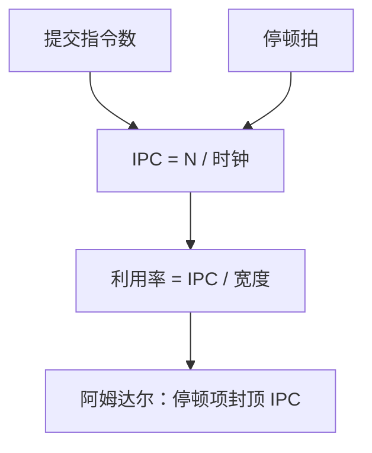

# IPC 与利用率

CPI 是每条指令多少拍；翻过来，IPC 是每拍提交几条。窗口、端口和停顿让这个数远小于发射宽度。

<footer>—— 据 Hennessy and Patterson, Computer Architecture: A Quantitative Approach 整理</footer>

[上一课](/cs/cpi-amdahl)把 CPU 时间写成指令数 × CPI × 周期，五级理想 CPI 为 1，停顿另加。本课不重推阿姆达尔公式。缺口是：一旦每拍可以完成不止一条（后课超标量），或反过来因停顿每拍完成不到一条，用「每拍指令数」看利用率更直接。本课只钉 IPC = 1/CPI（在单线程、按提交计时），以及利用率相对理想宽度的缺口。

## 问题

理想五级每拍提交 1 条，IPC = 1。load-use、误预测、结构冲突让 IPC $\lt$ 1，与 CPI > 1 是同一件事的倒数。设计者若只报时钟频率，看不出流水线经常空转。缺口不是新的冒险类型，而是**把吞吐写成 IPC，把空档写成利用率 = 实测 IPC / 理想宽度**。

上一课声明不引入 IPC 大于 1。本课把符号准备好：理想宽度暂时仍是 1；后课把宽度改成 $W$，理想 IPC 上限变成 $W$，利用率是 $\mathrm{IPC}/W$。

IPC 按提交计，不按投机执行计。冲刷掉的指令不进入分子，否则预测器会虚高。

## 方法

在一段程序上计数：提交指令数 $N$，时钟数 $C$，则 $\mathrm{IPC}=N/C$，$\mathrm{CPI}=C/N$。停顿分类仍用上一课：结构、数据、控制、异常。利用率 $u=\mathrm{IPC}/W$，$W=1$ 时 $u=\mathrm{IPC}$。

比较两种微结构时，同时看 IPC 与周期：转发 mux 可能降频率、升 IPC，净时间不一定赢。这与上一课「三项都要看」一致，只是把 CPI 换成它的倒数谈吞吐。

## 机制

流水线寄存器在飞、功能单元却等数据，就是利用率缺口。后课 cache 缺失把 MEM 级拉成许多拍，IPC 掉到接近 0 的区间，局部性课要解释为什么平均仍可救。本课只承认：IPC 对停顿过敏，对「指令算得更巧」不直接敏感——那是指令数 $N$ 的事。

超标量把 $W\gt 1$ 之后，相关与端口会让 $u$ 远小于 1：宽度 4 而 IPC 1.5 很常见。本课不引入发射逻辑，只把这个比值的位置留好。

## 边界

本课不把 IPC 写成可以大于宽度：那是计数错误或把别的硬件线程算进来。[SMT](/cs/smt) 才用多线程填空档。也不把 GPU 占用率写进来。Gustafson 按问题规模放大仍不在本课。

后课默认：谈到吞吐，可以用 CPI 或 IPC；五级理想 IPC = 1。存储器层次将主导实测 IPC 掉到何处。

## 小结

- IPC 是提交指令数除以时钟，单线程下与 CPI 互为倒数。
- 利用率对照理想发射宽度；宽度 1 时即 IPC 本身。
- 局部性与 cache 将改写停顿项，对象仍是这条吞吐定义。
- 出处：Hennessy and Patterson, *CA:AQA* 第 1 章与流水线性能。
