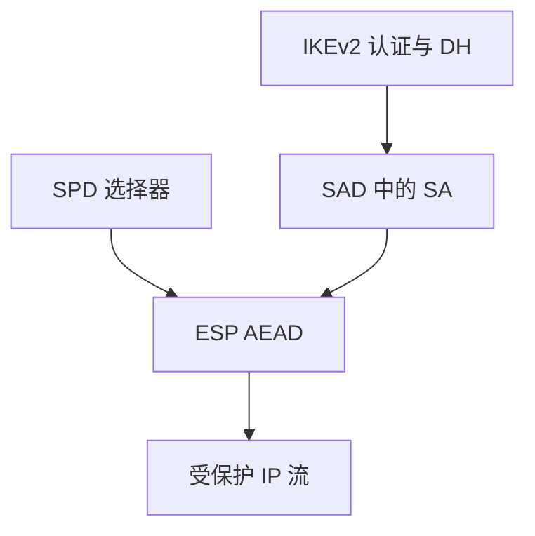

# IPsec 与 IKE

IPsec 把 AEAD 推到 IP 层：SPD 决定哪些流要保护，SAD 里是密钥与 SPI。IKE 负责协商与认证，失败时看起来像「VPN 连不上」，其实是身份与选择器没对齐。

<footer>—— RFC 4301；RFC 7296 IKEv2；Kent and Seo</footer>

## 定位

上一课[SSH](/cs/ssh-keys-auth)保护一条交互会话。缺口是**网段之间的策略**：整网段或整主机的 IP 流。主干网络课不重写；本课收 SPD/SAD 与 IKEv2 的合同。

后课默认已经读完本课钉下的合同，只补差，不从该领域第一性原理重开。

## 问题

应用各自 TLS 会漏掉非 TLS 流。IPsec：传输模式对主机，隧道模式对外网关。IKE 用 DH 与身份（PSK 或证书）建 SA。缺口是选择器过宽（所有端口一套 SA）与 PSK 共享——不是再讲 ESP 头字段百科。

### NAT 与 UDP 封装

ESP 遇 NAT 常走 UDP。封装不改变「要认证对端」这一条。

RFC 4301 架构。IKEv2 简化 IKEv1 的多轮。本课不给破 SA 的步骤。

## 方法

画：IKE 认证→子 SA→ESP 处理匹配 SPD 的包。对照 TLS：端点是应用 vs 主机/网关。指出策略冲突（旁路）比算法选择更常出事。

图中节点是本课的机制骨架；课程不把图展开成可运行的攻击步骤。

## 机制

网络层保密把中间路径变成密文，但不自动给应用身份。网关 VPN 常把所有远程用户变成一个内网源——零信任课会拆这条。下一课 WireGuard：刻意变小的另一合同。

前提写进合同之后，游戏外的误用只当失败模式点名，不在本课写成操作程序。

## 边界

本课不写全部 IKEv1 模式。WireGuard 下一课用 Noise 与静态钥把协商收短。

## 小结

- SSH 管登录；IPsec 管 IP 流策略。
- IKE 建 SA；SPD 决定什么必须进 ESP。
- PSK 与过宽选择器是常见合同松弛。
- 下一课 WireGuard。
- 出处：RFC 4301；RFC 7296；Kent and Seo。
