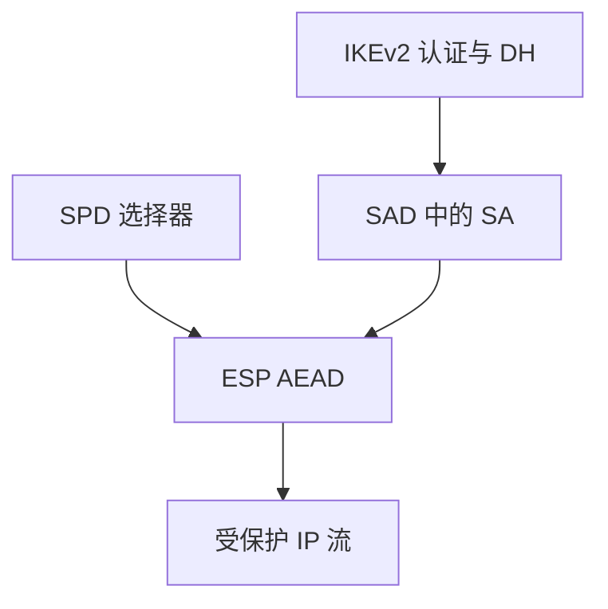

# IPsec 与 IKE

IPsec 把 AEAD 推到 IP 层：SPD 决定哪些流要保护，SAD 里是密钥与 SPI。IKE 负责协商与认证，失败时看起来像「VPN 连不上」，其实是身份与选择器没对齐。

<footer>—— RFC 4301；RFC 7296 IKEv2；Kent and Seo</footer>

上一课[SSH](/cs/ssh-keys-auth)保护的是一条交互会话。本课补**网段之间的策略**：整网段或整主机的 IP 流要按策略保护。主干网络课的内容不重写，这里收 SPD/SAD 架构与 IKEv2 的合同。

后课默认已经读完本课钉下的合同，只补差，不从该领域第一性原理重开。

## 问题

让应用各自跑 TLS 会漏掉非 TLS 流，策略也无法统一收口。IPsec 把保护下沉到 IP 层：传输模式保护主机到主机的载荷，隧道模式由网关封装整个 IP 包对外。密钥与算法装在 SA 里，由 IKE 用 DH 与身份认证（PSK 或证书）协商建立。缺口是两处合同松弛：选择器过宽——所有端口流量共用一套 SA，一失全失；PSK 共享——一组人共用同一预共享密钥，人走钥匙不换。不是再讲 ESP 头字段百科。

### NAT 与 UDP 封装

ESP 没有端口字段可改，遇 NAT 常被中间盒破坏，实践里通常包进 UDP（NAT-T）。封装只是穿过中间盒，不改变合同：对端身份仍必须经 IKE 认证，隧道通了不等于认证过了。

RFC 4301 架构。IKEv2 简化 IKEv1 的多轮。本课不给破 SA 的步骤。

## 方法

数据面流程：每个包先查 SPD 的选择器（源/目的/协议/端口），命中的按策略送 ESP，密钥从 SAD 里按 SPI 取出。控制面流程：IKE 先用 DH 与身份认证建 IKE SA，再在其保护下派生子 SA 给 ESP 用。与 TLS 对照：保护端点是应用对应用，还是主机/网关对网关。经验上策略冲突与旁路——某条流意外匹配了「旁路」条目——比密码套件选择更常出事。

```mermaid
flowchart TD
  IKE["IKEv2 认证与 DH"] --> SA["SAD 中的 SA"]
  SPD["SPD 选择器"] --> ESP["ESP AEAD"]
  SA --> ESP
  ESP --> IP["受保护 IP 流"]
```

## 机制

网络层保密把中间路径变成密文，但不自动给应用身份：网关解密后的包在内网以明文前进，应用看到的源是网关而非人。网关 VPN 常把所有远程用户汇成一个内网源地址，保护粒度到网关为止——零信任课会拆这条。下一课 WireGuard：刻意变小的另一合同。

## 边界

本课不写 IKEv1 的全部模式，主模式/野蛮模式的历史包袱从略。WireGuard 下一课用 Noise 与静态钥把协商收短。

## 小结

- SSH 保护登录会话；IPsec 按 policy 保护 IP 流。
- IKE 负责认证与建 SA；SPD 决定什么必须进 ESP。
- 共享 PSK 与过宽选择器是常见的合同松弛。
- 下一课 WireGuard。
- 出处：RFC 4301；RFC 7296；Kent and Seo。
