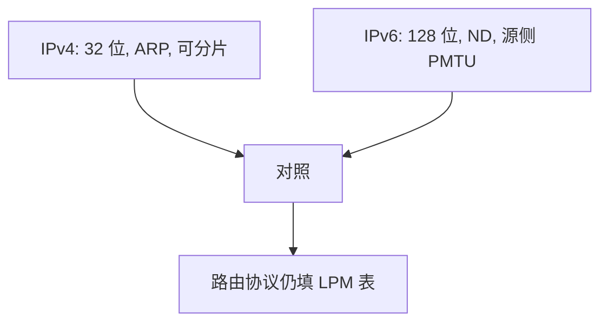

# IPv6 对照

IPv6 把地址加到 128 位，去掉头校验和与路由器分片；邻居发现取代 ARP。

<footer>—— 据 Deering and Hinden, RFC 8200, Internet Protocol, Version 6, 2017 整理</footer>

[上一课](/cs/napt)用租约与 NAT 缓解 IPv4 短缺。把 32 位拉长并清理头格式，是另一条路。缺口是**对照**：同一套[分层](/cs/layering-e2e)与 [LPM](/cs/lpm) 仍在，哪些 knobs 换了。本课不重写 CIDR 思想，不把全部扩展头类型背完。

## 问题

NAT 让大量主机挤在私网，入站连接与端到端校验变难。RFC 8200：128 位地址、固定 40 字节基本头、流标签、下一头字段链扩展头。路由器不分片，PMTU 交给源；无 IP 头校验和，交给链路与传输。缺口是这些与 RFC 791 的差异表，不是再讲一次掩码。

地址自动配置（SLAAC）与 ICMPv6 邻居发现替换 ARP，DHCP 变为可选。

教学对照：更大地址、无中间分片、ND 代替 ARP、仍是尽力而为。NAT64 等过渡机制是附录级，不插主干。

## 方法

转发仍 LPM，只是键为 128 位。主机：链路本地地址起步，路由器通告前缀，得全球地址。邻居请求/通告用组播，不再以太网广播 ARP。传输层端口语义不变，后课 TCP/UDP 仍用端口；套接字只是地址族变成 `AF_INET6`。

## 机制

IPv6 把[端到端论证](/cs/layering-e2e)里「地址应能命名端」的压力从 NAT 挪回地址空间。它不自动提供可靠性或拥塞控制。扩展头让 IPsec 等可插入，安全课再讲；本课不把加密当 IPv6 的定义特征——保密不是 RFC 8200 的必选项。

双栈主机两套表、两套默认路由，应用选族失败则试另一族，细节不展开。

## 边界

本课不把移动 IPv6、SHIM6 写进主干。不引入段路由扩展头的工程手册。也不声称「有 IPv6 就不再有 NAT」：运营上仍可能出现中间盒。控制平面如何在任意地址族上算下一跳，下一课从距离向量开始。

链路本地地址每条链路重复出现，转发表必须带着接口。全局地址才进默认路由那一套 LPM。

扩展头必须按顺序处理；未知的逐跳选项会让路由器丢包，这与 IPv4 选项一样是部署负担。

后课默认：转发对象可以是 v4 或 v6 前缀。表项从哪来，下一课距离向量。

## 小结

- IPv6（RFC 8200）对照：更长地址、ND、不分片、无头校验和。
- LPM 与尽力而为不变；不代替 TCP。
- 路由协议填表是下一课起的缺口。
- 出处：RFC 8200；RFC 791 对照；Kurose and Ross。
