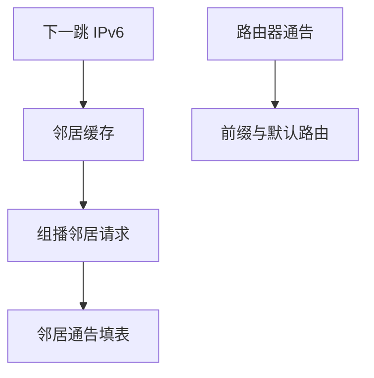

# IPv6 地址与 NDP

128 位地址仍用前缀划定链路；链路上的解析改成邻居发现，不再广播 ARP。

<footer>—— 据 Deering and Hinden, RFC 8200；Narten 等对邻居发现的整理</footer>

[上一课](/cs/ipv6-contrast)对照了头格式：无中间分片、无头校验、地址变长。本课不重列扩展头。缺口是地址怎么用、链路上怎么找到邻机：前缀仍决定直连，解析协议换成 NDP（邻居请求/通告），路由器通告代替很多 DHCP 选项。本课不把距离向量提前。

## 问题

[IPv6 对照](/cs/ipv6-contrast)说邻居发现取代 ARP，但没写表怎么填。主机仍要判断目的是否在链路上（前缀长），再把下一跳 IPv6 地址译成 MAC。NDP 用 ICMPv6 消息、组播而不是以太网广播问遍全网。无状态地址自动配置（SLAAC）让主机用通告的前缀自生成接口标识。缺口是**IPv6 的一跳合同**，与 [ARP 缓存](/cs/arp-cache) 同层、不同报文。

链路本地地址 `fe80::/10` 只在一跳有效。全局前缀由路由器通告。重复地址检测在启用前先邻居请求自己。

## 方法

查邻居缓存；未命中则向被请求节点组播发邻居请求，对端单播通告。路由器通告携带前缀、MTU、是否当默认路由。重定向告诉「更好的下一跳」。缓存同样有可达性探测与超时，避免把流量打到已离开的 MAC。

## 机制

NDP 把 ARP + 部分 ICMP 路由器发现收进 ICMPv6，仍只服务一跳。[LPM](/cs/lpm) 在 IPv6 上同样按最长前缀。NAPT 不再是地址不足的理由；防火墙状态仍可存在。端到端：NDP 不保证全球到达，只保证这一跳封装对。

## 边界

本课不把 SEND 与全部 RA 选项当必背，不引入 IPv4/IPv6 双栈过渡的全部隧道。路由如何填全球表，下一课距离向量。

后课默认：IPv6 链路上用 NDP 缓存邻接。控制平面如何学前缀，下一课。

## 小结

- RFC 8200 的地址仍靠前缀划链路；解析用 NDP。
- 路由器通告给出前缀与默认路由。
- 填全球转发表是下一课距离向量。
- 出处：RFC 8200；Kurose and Ross；邻居发现文献（Narten 等）。
