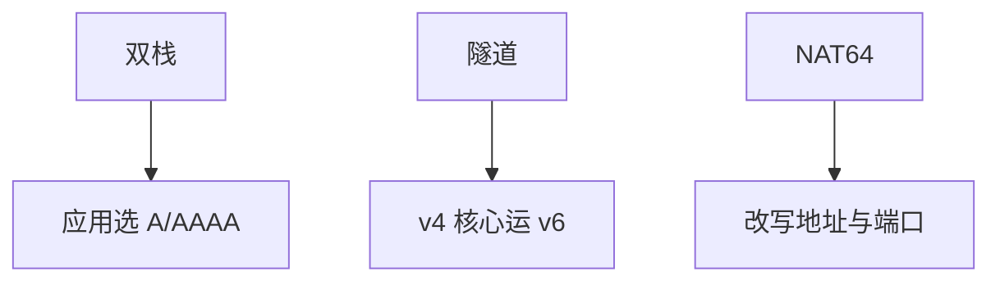

# IPv6 过渡技术

双栈、隧道、翻译三条路：主机同时两套、用 IPv4 云运 IPv6（或反过来）、或 NAT64 改头；没有免费的「只打开 v6」。

<footer>—— 据 RFC 4213 双栈与隧道；RFC 6146 NAT64；RFC 6180 过渡指导整理</footer>

主干[IPv6 对照](/cs/ipv6-contrast) 与 [NDP](/cs/ipv6-ndp) 已给地址与邻居。[上一课](/cs/multicast-igmp-pim) 的 MLD 是 v6 侧 IGMP。缺口是**与仍在的 IPv4 共存**：6in4、DS-Lite、464XLAT、NAT64/DNS64。本课不把 PMTUD 写完。

## 问题

核心若只会 v4，边缘已有 v6 主机：要隧道（GRE/6in4/IP-in-IP）或翻译。翻译破坏端到端地址真值，应用 ALGs 脆弱——[端到端论证](/cs/layering-e2e) 在此再次出场。双栈：每应用选栈，DNS 有 A/AAAA，Happy Eyeballs 竞速。CGN 把 v4 节省下来，不推进 v6，只拖延。

不要把 IPv6 过渡写成安全课：IPsec 曾被神话为 v6 内置强制，实践不是。

RFC 6180 分类场景。464XLAT 让 IPv4 套接字在 v6-only 网上活。本课不把每个实验 RFC 列成清单。

### 没有免费只开 v6

双栈最干净；隧道穿越；翻译牺牲地址真值。v6 无源分片，更依赖 PMTUD。CGN 只拖延 v4。

## 方法

对照三列：双栈 / 隧道 / 翻译。画：AAAA → 原生 v6；否则 DNS64 合成 → NAT64。与 VXLAN 对照：都是封装，过渡隧道的「租户」是地址族。

方法止于选定对象与对照；机制才说它如何嵌入已有分层与主干课。

## 机制

BGP 可同时带 v4/v6 地址族；RPKI 也有 v6 ROA。MTU：隧道再扣头，v6 不允许源分片，更依赖 PMTUD 下一课。ECMP 要按新五元组。手机核心常 v6-only + 464XLAT，接住蜂窝课的锚点。

SIIT 无状态翻译与 NAT64 有状态：规模与日志不同。

## 边界

本课不引入 MAP-T 的端口映射数学全文。路径 MTU 发现是下一课。后课默认：过渡是封装或翻译，双栈是最干净但最贵的并存。

只部署 SLAAC 而不管 DNS 与防火墙，过渡等于没做。

上一课留下的缺口在本课收口；「IPv6 过渡技术」进入后课词汇表后只引用。文献用来钉对象与边界，不把本课写成该主题的独立综述。下一课[路径 MTU 发现](/cs/pmtud)。

## 小结

- 双栈并存、隧道穿越、翻译妥协。
- 翻译牺牲地址真值与部分应用。
- v6-only 边缘常用 NAT64/XLAT。
- 后课只引用本课钉死的对象，不从该领域总问题重开。
- 出处：RFC 4213；RFC 6146；RFC 6180。
