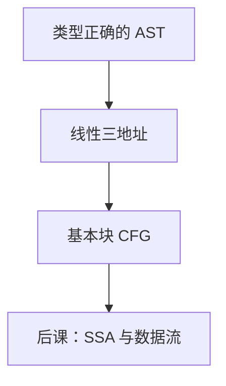

# 三地址中间表示

把表达式树压成 $x\leftarrow y\,\mathrm{op}\,z$ 的序列，控制流用跳转与标号；前端与 ISA 在此脱钩。

<footer>—— 据龙书第 6、8 章整理</footer>

上一课[overload 与强制](/cs/overload-coerce)保证节点有类型与宽度。本课不重写类型规则。缺口是：AST 嵌套不便做数据流与指令选择。三地址码（或等价的四元组）把计算写成最多两个源、一个目的，临时变量无限。本课只钉这种 IR 的形状；SSA 是下一课加的约束。

## 问题

AST 上的 `a+b*c` 要规定求值顺序、临时名、以及 `if` 的跳转。若直接对[RISC-V](/cs/riscv-int-isa) 发指令，优化绑死 ISA，前端无法共用。[编译器通行证](/cs/compiler-passes)已经声明中端存在；本课给出对象：指令表 + 基本块。

三地址不是物理寄存器：名字是虚拟的。数组下标、指针解引用写成带类型宽度的 `load/store`。调用写成 `call`，参数按抽象约定，具体寄存器在 ABI 课。

### 三地址不是「只能三个数」

名字来自最多两个操作数加结果。比较与跳转、过程调用、φ 还没有。基本块：单入口单出口的直线序列。块间构成 CFG——算法课的[图](/cs/graph-definition)在此第一次成为程序的控制图，不是源文本。

龙书用三地址作中端教科书 IR。四元式 $(op,y,z,x)$ 是同一信息。LLVM IR 等是工业形态，本课不搬家。无限临时由后课寄存器分配收紧。

## 方法

后序遍历表达式：为每个内节点分配临时，发一条指令。布尔与短路做成跳转。循环拆成条件跳与回边。输出：指令列表或块链表。

[DAG](/cs/dag-repr) 可在块内表示公共子表达式，本课允许块内 DAG，不强制全局。临时名按出现次序编号即可，不必此时就 SSA。

## 机制

IR 使窥孔、活跃变量、指令选择有固定接口。正确性：与 AST 的求值语义一致，含短路与副作用顺序。临时变量的活跃区间下一课之后才算。不要在本课选物理寄存器。

## 边界

本课不写 SSA 的 φ、不做全局数据流、不选机器指令。不把解释器当 IR。后课默认：中端对象是三地址 + CFG。静态单赋值是下一课对名字的约束。

## 小结

- 三地址把树压成 $x\leftarrow y\,\mathrm{op}\,z$ 与跳转。
- 基本块 CFG 才是可做数据流的图。
- 名字虚拟，未分配寄存器。
- 块内可收成 DAG；全局 SSA 是下一课。
- 出处：Aho et al., 龙书第 6、8 章。
