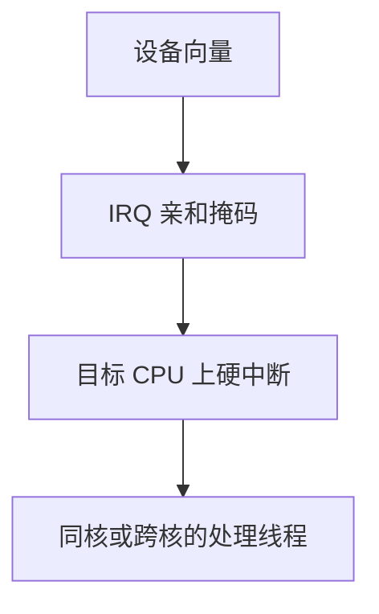

# 中断亲和

把一条 IRQ 绑到指定 CPU 集合，是为了局部性与隔离，不是为了让所有核轮流当中断靶子才算公平。

<footer>—— 据 Love, Linux Kernel Development；Tanenbaum MOS 对多处理器中断的整理</footer>

[上一课](/cs/irq-thread)让处理可以是某条内核线程。线程跑在哪颗 CPU 上，还取决于这条 IRQ 被投递到哪。[互连与 NUMA](/cs/interconnect-numa) 已经说明远端访问更贵。缺口是：**中断亲和**——I/O APIC / MSI 把向量送到哪些核——从而决定上半部在哪跑、缓存里热的是哪套描述符。本课只钉投递集合，不写负载均衡迁移算法。

## 问题

若所有设备中断都打到 CPU0，该核的[调度指标](/cs/scheduling-metrics)被 ISR 与软中断淹没，其它核再公平也救不了这条延迟。若每条 IRQ 在所有核间乱跳，网卡环形缓冲的 cache 行会来回失效。缺口不是新的下半部种类，而是把 IRQ 的 CPU 掩码当成配置对象：可以绑单核、可以绑一个 NUMA 节点。

亲和是投递策略。处理线程还可以另有 CPU 亲和；两者不一致时，上半部在 A 核，线程在 B 核，多一次跨核唤醒。

## 方法

硬件：MSI/MSI-X 或 I/O APIC 表项里写目标 APIC ID 或集合。内核：为每条 IRQ 保存 `cpumask`，在亲和变更时重编程硬件。隔离：实时 CPU 可以从掩码里拿掉，使那些核几乎只跑期限任务。本课不把 `/proc/irq` 的管理接口当正文。

与后课 CPU 亲和（线程绑核）是一对：一个管中断从哪进，一个管线程在哪跑。本课只管前者。

## 机制

正确的亲和让上半部碰到的描述符仍在该核 L1/L2，也让「时钟中断打在每核、设备中断打在指定核」成为可叙述的政策。错误的亲和制造虚假热点：看起来利用率不高，其实 CPU0 的软中断占满。这与公平调度摊时间不是同一把尺子——中断不是 CFS 实体。

平衡设备中断可以用轮转或按队列的 RSS/多队列网卡：每条队列一个 MSI-X 向量、一个掩码。主干只承认多向量，不写驱动。

## 边界

本课不把中断重均衡守护进程写成必装组件，不讨论虚拟化里 IRQ 投递到 vCPU 的全部路径。NMI 与机器检查往往不受普通亲和表约束，下一课单独处理。

后课默认：设备 IRQ 可绑核。有一类中断不能按普通掩码推迟或屏蔽，下一课讲 NMI。

## 小结

- 中断亲和：向量投递到哪些 CPU，影响缓存与隔离。
- 与线程绑核相关但不是同一对象。
- 不可屏蔽中断是下一课。
- 出处：Love, *LKD*；Tanenbaum and Bos, *MOS*。
