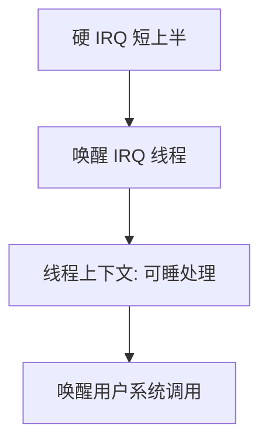

# 中断线程化

把 IRQ 处理做成可调度的内核线程，延迟变成调度问题，于是可以用优先级对抗共享锁上的反转。

<footer>—— 据 Love, Linux Kernel Development；Silberschatz et al. 对中断处理的整理</footer>

[上一课](/cs/tasklet-workqueue)把可睡工作丢给 kworker，但硬 IRQ 与 tasklet 仍在中断/软中断上下文，优先级不归调度器管。实时路径上，一次长 tasklet 可以挡住高优先级线程。[实时调度对照](/cs/realtime-sched)已经警告 ISR 会拉长最坏执行。缺口是：让该 IRQ 的下半（甚至大部分处理）跑在**专门的中断线程**里，用调度策略而不是关中断来排队。本课只钉这个模型。

## 问题

软中断在返回路径上跑，等于临时继承了被打断线程的上下文，却没有自己的调度实体。线程化：上半部仍极短（应答、唤醒 IRQ 线程），其余在 `irq/n-foo` 一类内核线程中执行，可睡、可被设为实时优先级。缺口不是新的 PIC 硬件，而是把「谁在处理这条 IRQ」变成调度器看见的线程。

主线上半部仍不能睡。线程化降低的是**处理函数主体**的上下文，不是取消硬中断入口。

## 方法

注册 IRQ 时声明 threaded：内核创建或复用处理线程。硬中断：清设备或仅屏蔽，然后唤醒该线程。线程：抢到 CPU 后跑处理函数，必要时再开中断。多个 IRQ 可各有线程，优先级按设备紧迫性配置——配置细节是运维，主干只要求存在独立调度实体。

与 workqueue 的差别：IRQ 线程绑定这条中断的生命周期与默认优先级，而不是通用工人池。两者可叠加。

## 机制

线程化把中断延迟从「关中断时长」改写成「IRQ 线程何时被选中」。于是[调度指标](/cs/scheduling-metrics)与实时队列可以直接作用在处理路径上。代价是多一次唤醒与切换；对高频网卡可能不划算，对慢速设备与实时外设划算。共享数据仍要锁；但持锁者是线程，可以用睡眠锁，只要上半部不碰同一把睡眠锁。

## 边界

本课不把每块驱动是否 threadirqs 的 Kconfig 写完，不保证桌面发行版默认全部线程化。优先级反转若锁在 IRQ 线程与用户实时线程之间，完整协议在同步课。也不把用户进程当成 IRQ 线程来跑驱动。

后课默认：IRQ 处理可以是可调度线程。多核上这条 IRQ 该送到哪颗 CPU，下一课讲中断亲和。

## 小结

- 线程化 IRQ：短硬上半 + 可调度处理线程。
- 延迟变成调度问题；高频路径未必适合。
- 送到哪颗核是下一课亲和。
- 出处：Love, *LKD*；Silberschatz et al., *OSC*。
