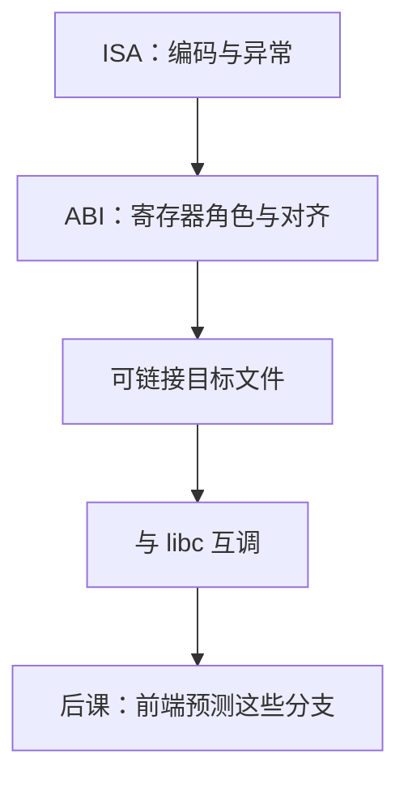

# ISA 作为 ABI 边界

  
ISA 保证指令与异常；ABI 保证参数在哪几个寄存器、栈如何对齐、哪份扩展算「这颗用户程序的机器」。越过这条线，合法编码仍无法与 libc 互调。

  <footer>—— 据 System V Application Binary Interface；RISC-V ELF psABI；ARM Procedure Call Standard；Patterson and Hennessy, Computer Organization and Design 整理</footer>

[上一课](/cs/alignment-access)把自然对齐写成硬件与陷阱。[调用约定](/cs/calling-convention-stack) 与[代码生成](/cs/abi-codegen) 已在组成/编译课出现过。本单元对照完 x86、ARM、RISC-V 之后，缺口是把这些事实收成 **ABI 边界**：哪些是硅保证的，哪些是软件合同，以免后课微结构把 `a0` 当成 ISA 强制。

## 问题

ISA：寄存器堆、指令编码、[fence](/cs/fence-instructions)、[Sv39](/cs/sv39-page-table)、端序、对齐陷阱。ABI：参数前几个进 `a0`–`a7` 还是 `rdi`/`rsi`，栈 16 字节对齐，浮点/向量寄存器谁保存，结构体如何拆，系统调用号与返回值错误约定。缺口不是再画栈帧，而是**同一 ISA 上可以有多份 ABI**（SysV vs Windows x64；RISC-V ILP32 vs LP64；带不带 `C`/`F`/`D`/`V`）。

可执行文件还要 ELF 头、重定位、GOT/PLT；那是加载器合同，比单条 `jal` 更宽。硬件不读 ELF。把「能在这颗核上跑」等同于「能链上 glibc」，对照课会在动态链接处翻车。

### ABI 不是指令子集

没有哪条 RISC-V 指令强制 `sp` 16 字节对齐；AAPCS64 与 psABI 写了。违反时硬件可能仍执行，直到 SIMD spill 或系统调用入口检查失败。[压缩](/cs/riscv-compressed) 是否存在，改变的是目标三元组，不是 opcode 合法性本身。

SysV AMD64 ABI；RISC-V ELF psABI；AAPCS64。Patterson/Hennessy 用调用例子连接组成与软件。本课不抄整张寄存器角色表。

## 方法

编译与链接选定三元组：`riscv64-linux-gnu` 意味着 LP64、小端、特定系统调用。代码生成遵守合同；手写汇编同样。上下文切换保存 ISA 状态（GPR、[SIMD](/cs/simd-extensions) 宽寄存器、[RVV](/cs/rvv-vector) `v` 与 `vl`），其布局又是内核 ABI。用户程序看不见 `hgatp`，那是 H 扩展的特权面，不进入 psABI。

系统调用是另一条边界：`ecall`/`syscall`/`svc` 是 ISA；号与参数槽是 OS ABI，本课点名即止。

## 机制

数字系统与接口的 ISA 对照在此封口：后课不再换指令集哲学，而是假定一份已冻结的用户可见 ISA+ABI，问微结构如何把它跑快。下一课起是[微结构进阶](/cs/gshare-predictor)：组成课已经用饱和计数器猜方向；现在要处理相关分支——ISA 只定义 `beq` 是否跳，不定义前端如何猜。gshare 从这里接过。

## 边界

本课不写完整 psABI 附录，不比较发行版动态链接器。不把 Windows / Linux 的系统调用表当 ISA。不进入量化策略的 FFI。

后课默认：能互调的程序共享 ABI；ISA 只保证单颗核如何执行指令。下一课 gshare 预测器。

## 小结

- ISA 是硬件合同；ABI 是软件互调合同。
- 同一 ISA 可有多份 ABI；扩展集写进目标三元组。
- 本单元对照结束，微结构进阶从分支预测开始。
- 出处：SysV ABI；RISC-V ELF psABI；AAPCS64；Patterson and Hennessy, COD。
